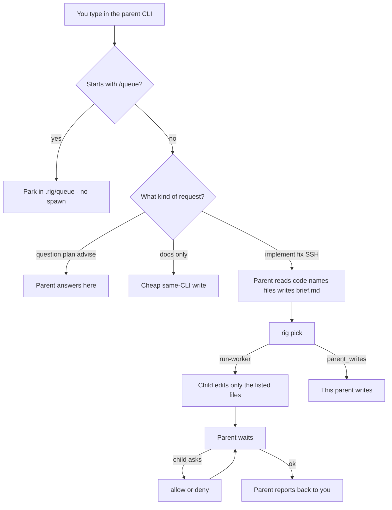
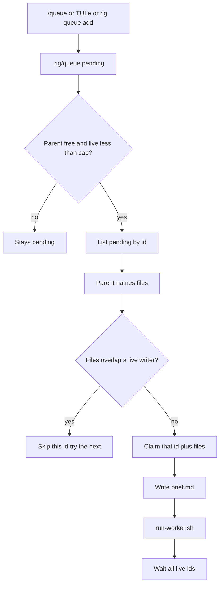

# Rig

A local parent/worker kit. You stay in one parent CLI. You type a prompt. The parent hands the work to a child, then checks the result and sends feedback — the loop you used to do yourself, sitting on one agent.

Intended parent is **Codex running Astra** (the human-like assistant). Grok, OpenCode, OMP, Pi, and agy can also be the parent. Claude and Cursor are never the parent. Missing worker binary → cheaper same-CLI. That is success.

## Why

Using AI to ship a feature often means **you** become the bottleneck. You read every diff. You write every correction. You get tired. The work stops being smooth.

Sol made an agent feel like a person at the computer. Astra went further. Rig is the harness around that:

1. You talk to the **parent** (Astra in Codex, or another parent CLI you opened).
2. The parent assigns the task to a **child** (Grok, Claude, Cursor, OpenCode, OMP, Pi, agy, Codex).
3. The parent **checks, verifies, and gives the child feedback** (`rig jobs`, allow/deny, a follow-up prompt) — the same review loop you used to run by hand.

Open Codex on Astra as the parent. Pick the parent model in that CLI. Worker models come from `rig pick`. Never spawn Astra, Sol, or Fable as a child.

## What you get after setup

After `rig setup` + fully quit the parent once:

| Surface | What it does |
| --- | --- |
| `/queue …` in Grok, Codex, OpenCode, OMP, Pi | Parks work in **this repo’s** `.rig/queue/`. Does **not** spawn a child. Codex: `/plugins` **Rig Queue** then `/hooks` trust (0.154 has no `/prompts:queue` slash). |
| HUD | Grok/agy statusline, OMP/Pi widget under the editor, OpenCode sidebar/footer. Shows QUEUE + live/ASK. Codex has no custom panel — use the hook toast or `rig tui`. |
| Drain | On a **free** parent turn the parent claims by **id**, names files, writes `brief.md`, then `run-worker.sh`. HUD refresh never spawns. |

Update an existing machine: `rig update`. Then fully quit the parent once.

## How your prompt is handled

You type in the **parent**. Rig does **not** forward that chat as the child’s prompt. The parent classifies the request, and only implement-like work becomes a `brief.md` for a child.



| You type | What happens |
| --- | --- |
| `How does pick choose a worker?` | Stay. Parent answers. No child. |
| `Fix the failing tests in tests/test_cli.py` | Parent names files → brief → child (or `parent_writes`). |
| `/queue fix the sidebar after this job` | Park only. The running child is not interrupted. |
| `Review the diff I staged` | Review worker, different vendor than the writer. |

Details and walk-throughs: [Usage](docs/usage.md#how-your-prompt-is-handled).

## Why the queue exists

The parent takes **one prompt at a time**. While a child runs (often minutes), you think of more work but cannot send it without interrupting wait/ASK. Park the extras; on a free turn the parent drains, briefs, and spawns — up to 3 live jobs when listed files are disjoint. Park does **not** spawn.

Longer why (two locks, without vs with): [Usage](docs/usage.md#why-the-queue-exists).

## How the queue works

`/queue` is a **parking lot**, not a dispatcher. Nothing in the hook, HUD, or TUI `e` key calls `run-worker.sh`.



Cap is `[queue].max_running` (default 3 live `running`+`ask`). Claim **by id** when more than one item is pending. Mid-wait: `/queue` / TUI `e` / `rig queue add` — never a second writer on the same files.

## Install

```bash
curl -fsSL https://raw.githubusercontent.com/Brasth/Rig/main/install.sh | bash
```

No GitHub login. It clones over HTTPS, copies into `~/.rig`, puts `rig` on `~/.local/bin`, runs `rig setup`, and deletes the temp clone. Same curl later is idempotent. It does **not** overwrite a project’s `.rig/harness.toml` or `.rig/MEMORY.md`.

Already have `rig` on PATH: `rig update` (GitHub `main`, same installer). Older `rig` without that command still needs the curl once.

From a checkout you already have: `./install.sh` (copies the local tree + `rig setup`, no clone).

**PATH (only if `rig` is not found):**

```bash
export PATH="$HOME/.local/bin:$PATH"
echo 'export PATH="$HOME/.local/bin:$PATH"' >> ~/.zshrc
source ~/.zshrc
```

`which rig` must print `$HOME/.local/bin/rig`.

You need one parent CLI: Codex, Grok, OpenCode, OMP, Pi, or agy. Optional worker binaries: `grok`, `claude`, `cursor-agent`, `codex`, `opencode`, `omp`, `pi`, `agy`.

## Per project

```bash
cd your-repo
rig init
rig doctor
```

`rig init` is per repo. Do this in every project you want Rig to manage. Existing `.rig/harness.toml` flags are never flipped.

Fully quit the parent CLI once after first install (not just the tab — quit the apps). MCP tools and the Grok status line load on a cold start.

Open a **new** thread in that repo. An already-open session will not pick up `AGENTS.md` or skills.

Type a normal prompt in that parent CLI. Example: `fix the failing tests in tests/test_cli.py`. Do **not** use `rig run` for normal work.

## Configure

```bash
rig use grok|codex|opencode|omp|pi|agy
rig workers grok=on|off claude=on|off codex=on|off cursor=on|off opencode=on|off omp=on|off pi=on|off agy=on|off
```

```toml
parent = "codex"
# parent = "grok"
# parent = "opencode"
# parent = "omp"
# parent = "pi"
# parent = "agy"

[workers]
codex = false
grok = true
claude = true
cursor = false
opencode = false
omp = false
pi = false
agy = false
```

- **Live parent** is whichever Codex, Grok, OpenCode, OMP, Pi, or agy you actually opened (`rig status`). The `parent =` key is only the preferred default (`rig use grok|codex|opencode|omp|pi|agy`). Opening the CLI is what makes it live.
- Parent **model** is the CLI’s model. Worker models come from `rig pick`. Never spawn Sol, Astra, or Fable as a child.
- A worker is **effective** only when: flag true **and** binary on PATH **and** not the live parent.
- Claude Code and Cursor are never the parent.
- Grok Bot.app and Cursor.app are GUIs, **not** spawnable workers. The Cursor worker binary is `cursor-agent`.

## Watch

- Board: `rig tui` / `rig jobs` / `/rig`
- Park: `/queue …` (see table in [Usage](docs/usage.md#watch-jobs-memory)) or `rig tui` key `e`
- HUD: Grok/agy statusline, OMP/Pi widget, OpenCode sidebar. Codex: `/plugins` **Rig Queue** then `/hooks` (no panel)
- Pi `/rig` also needs `pi install npm:pi-mcp-adapter`

Jobs and MEMORY are this repo, not the chat. A new thread still sees `.rig/jobs`. Running children keep going.

Parent orchestration is MCP (`rig_session`, `rig_job_wait`, `rig_job_allow` / `rig_job_deny`). Launching a child is still `run-worker.sh`. Claude `ask` → allow/deny; never kill that job.

More: [Usage](docs/usage.md) (prompt routing, queue scenarios, setup, doctor, troubleshooting).
Parent spawn protocol: `.agents/skills/delegate-harness/SKILL.md` (also the `<!-- rig:start -->` block in `AGENTS.md`).
