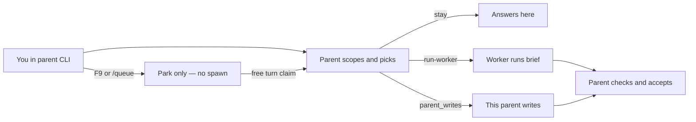
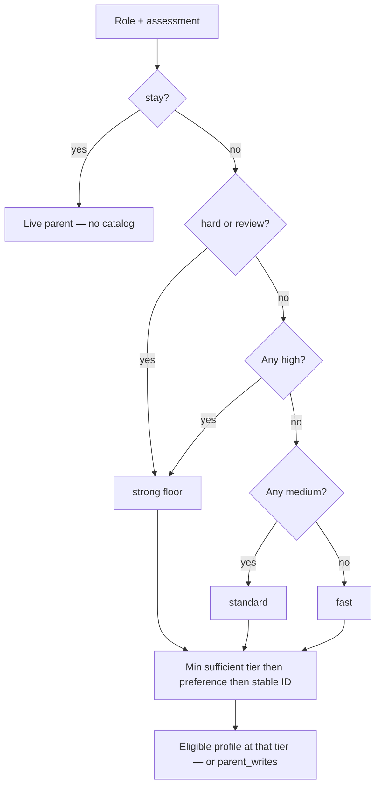
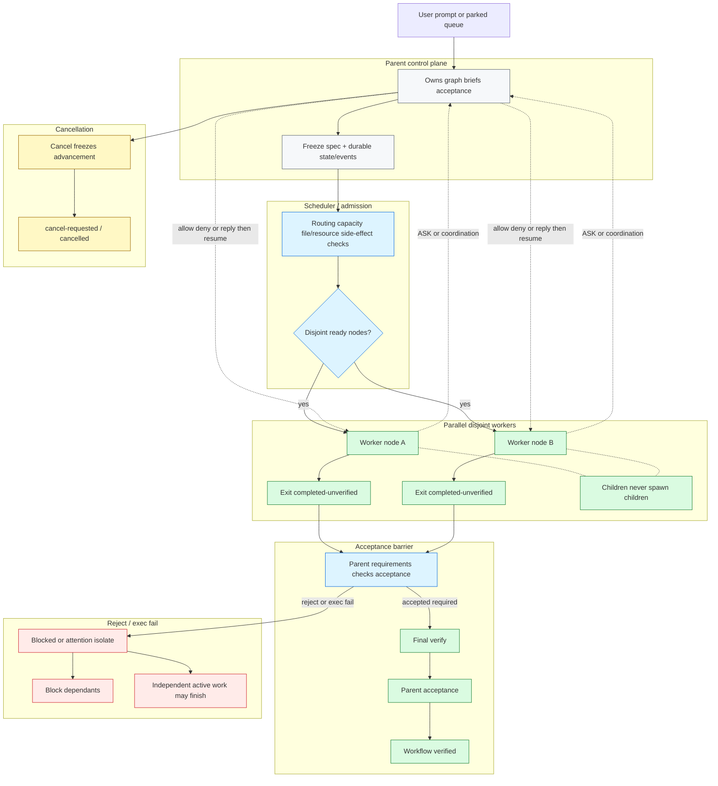

# Rig

Stop babysitting coding agents.

Rig is a CLI harness. You talk to a parent agent; it scopes work, briefs workers over MCP, then verifies results. Done means accepted checks, not exit 0 vibes.

**New: Adaptive workflows** (default). The parent can decompose eligible work into a DAG of disjoint workers, own the graph, briefs, and acceptance, and only mark verified after parent checks. Children never spawn children. See [Adaptive workflows](#adaptive-workflows) and [How an adaptive workflow moves](#how-an-adaptive-workflow-moves).

[](https://youtu.be/KuhHMH--oGk)

Failing tests → Codex parent → Rig TUI → Grok worker over MCP → parent verifies → green.

- Parent scopes files (no dumping the whole chat as the child prompt)
- Worker runs from a brief over MCP (adaptive: parallel disjoint nodes under parent control)
- Parent verifies before you merge

## Quickstart

```bash
curl -fsSL https://raw.githubusercontent.com/Brasth/Rig/main/install.sh | bash
cd your-repo
rig init
```

Configure the preferred parent and workers in `.rig/harness.toml` (preferred). Then open a parent CLI and type a normal prompt, for example `fix the failing tests in tests/test_cli.py`. Do not use `rig run` for normal work.

**Parents:** Intended: Codex on Astra. Also supported: Grok, OpenCode, OMP, Pi, or agy (open that CLI). **Never the parent:** Claude Code, Cursor, and Devin. **Effective workers:** Grok, Claude, OpenCode, OMP, Pi, agy, Codex, and opt-in Devin (SWE-2 only). Cursor integration is disabled pending scoped MCP. Missing worker binary → that worker is off. If no eligible worker exists, parent fallback preserves its actual model. Never spawn Astra, Sol, or Fable as a child.

**Try the demo:** [failing tests through parent verify](https://youtu.be/KuhHMH--oGk).

## Navigation

- [Overall flow](#overall-flow)
- [Install](#install) · [Per project](#per-project) · [Configure](#configure)
- [Smart routing](#smart-routing)
- [Adaptive workflows](#adaptive-workflows) · [How an adaptive workflow moves](#how-an-adaptive-workflow-moves)
- [Everyday prompts and queue](#everyday-prompts-and-queue)
- [Optional terminal companion](#optional-terminal-companion) · [Watch](#watch)
- [Verification and cancellation](#verification-and-cancellation)
- [Troubleshooting](#troubleshooting) · [Docs](#docs)

## Overall flow



You type in the **parent**. Rig does **not** forward that chat as the child prompt. The parent chooses a role, may assess complexity/risk/uncertainty, then `rig_session` / `rig_pick`. Stay work answers locally. Assigned work becomes brief TEXT for MCP `rig_job_launch` (creates scoped `brief.md`). Queue park never launches a worker. Details: [Usage — how your prompt is handled](docs/usage.md#how-your-prompt-is-handled).

## Install

Default install and `rig update` fetch GitHub **`main`**:

```bash
curl -fsSL https://raw.githubusercontent.com/Brasth/Rig/main/install.sh | bash
```

No GitHub login. Clones over HTTPS, copies into `~/.rig`, puts `rig` on `~/.local/bin`, runs `rig setup`, deletes the temp clone. Idempotent. Does **not** overwrite a project’s `.rig/harness.toml` or `.rig/MEMORY.md`.

First install and `rig update` also try to install or upgrade tmux to **3.3+** (Homebrew on macOS; apt-get/dnf on Linux). Compatible tmux is left alone. Set `RIG_SKIP_TMUX_INSTALL=1` to opt out. The terminal companion still needs explicit opt-in below.

Already have `rig` on PATH: `rig update` (same `main` installer). Older `rig` without `update` still needs the curl once.

Smart routing is included in `main`. New installations use it by default; existing installations can update with `rig update`, then fully restart parent/MCP sessions after safely finishing active work. An explicit `[routing] mode = "legacy"` setting remains in effect.

```bash
./install.sh
```

`./install.sh` copies the **local** tree + `rig setup` (no clone).

**PATH (only if `rig` is not found):**

```bash
export PATH="$HOME/.local/bin:$PATH"
echo 'export PATH="$HOME/.local/bin:$PATH"' >> ~/.zshrc
source ~/.zshrc
```

`which rig` must print `$HOME/.local/bin/rig`.

You need one parent CLI: Codex, Grok, OpenCode, OMP, Pi, or agy. Optional worker binaries: `grok`, `claude`, `cursor-agent`, `codex`, `opencode`, `omp`, `pi`, `agy`, `devin`.

Before updating an active repository: stop new admissions, finish or cancel existing work, confirm stopped, accept or close scopes, preserve data, update every launcher and managed protocol, then fully restart all parent/MCP sessions. Mixed old/new admission writers are unsupported. Adaptive-workflow rollback sets `[orchestration] mode = "single"` and never deletes data. See [safe upgrade](docs/usage.md#safe-upgrade-and-rollback).

## Per project

```bash
cd your-repo
rig init
rig doctor
```

`rig init` is per repo. Existing `.rig/harness.toml` flags are never flipped.

Fully quit the parent CLI once after first install (quit the apps, not just a tab). MCP tools and status lines load on a cold start. Open a **new** thread in that repo so `AGENTS.md` and skills load.

Type a normal prompt in that parent CLI. Example: `fix the failing tests in tests/test_cli.py`. Do **not** use `rig run` for normal work.

## Configure

Edit `.rig/harness.toml` to set the preferred parent and enable only installed, configured workers:

```toml
parent = "codex"

[workers]
codex = false
grok = true
claude = true
cursor = false
opencode = false
omp = false
pi = false
agy = false
devin = false

[orchestration]
mode = "adaptive"
max_nodes = 12
```

Optional shortcuts for the same keys:

```bash
rig use codex
rig workers grok=on claude=on
```

- **Live parent** is whichever Codex, Grok, OpenCode, OMP, Pi, or agy you actually opened (`rig status`). The `parent =` key is only the preferred default. Optional shortcut: `rig use …`. Opening the CLI makes it live.
- Parent **model** is that CLI’s model. Worker models come from `rig pick`. Picking never switches the live parent model.
- A worker is **effective** only when: flag true, binary on PATH, not the live parent, and job-scoped MCP ready. **Cursor remains excluded** until safe scoped MCP exists.
- Claude Code and Cursor are never the parent. Grok Bot.app and Cursor.app are GUIs, not spawnable workers. Cursor worker binary is `cursor-agent`.
- Rollback ladder: `[routing] mode = "legacy"` in harness (smart is default when mode is omitted). Orchestration: `[orchestration] mode = "adaptive"` (default) or `"single"`; `max_nodes = 12`. Queue and worker caps remain authoritative.

## Smart routing

Smart routing is **deterministic policy**: role plus complexity / risk / uncertainty map to a minimum tier, then an eligible model+effort profile. It is **not** an LLM classifier and **not** a learning/ranking system. `rig routing report` is read-only and does not change future picks.

| Role | Default complexity / risk / uncertainty | Minimum tier |
| --- | --- | --- |
| explore, mini, bulk | low / low / low | fast |
| implement | medium / medium / medium | standard |
| hard | high / medium / high | strong |
| review | high / medium / medium | strong |
| stay | not assessed | live parent; no catalog discovery |

**Tier rule:** any **high** → **strong**; else any **medium** → **standard**; else **fast**. Hard and review cannot go below **strong**. Explicit role wins over task-text inference. High risk may recommend independent review later; that is not automatic and is not claimed here.



Eligibility still requires worker flags, binary, live-parent exclusion, scoped MCP readiness, excludes, model bans, and catalog confirmation where required. A tier is a floor: not every candidate has a fast (or any) profile. Default fast/standard worker preference order: Grok, Claude, OpenCode, OMP, Pi, agy, Codex. Strong/review: Claude, Grok, OpenCode, OMP, Pi, agy, Codex. Devin is child-only SWE-2 (`swe-2-medium` / `swe-2-high` / `swe-2-max`) and is not in that default order; list its profile IDs in `.rig/routing.json` preferences to opt in. Optional `.rig/routing.json` can override preferences; config never enables workers. Schema 1 remains valid. Codex exploration defaults to `gpt-5.6-luna` via profile `codex-explorer-low`; an opt-in override may set that profile's selector to `gpt-5.3-codex-spark`. Spark is not a baseline and is not valid for write roles. Schema 2 may set `execution.direct_parent_low_risk` (default false) so low-risk mini/implement can use this parent before catalog lookup; that still uses `rig_job_start` / finish / accept. Rollback remains `[routing] mode = "legacy"`, or set `execution.direct_parent_low_risk` to false.

Inspect a decision and outcomes:

```bash
rig pick implement --case "Update a label" \
  --complexity low --risk low --uncertainty low \
  --assessment-reason "One isolated string" --explain

rig session --role implement --case "Change admission checks" \
  --risk high --compact --explain

rig pick mini --case "Small but unfamiliar configuration change" \
  --uncertainty high --json

rig routing report --days 30 --json
```

Full profiles, catalog rules, MCP fields, and rollback: [smart routing](docs/smart-routing.md). Independent review unavailable stays explicit.

## Adaptive workflows

Adaptive workflows are the default way Rig splits work you should not babysit. The parent owns the graph: it briefs disjoint workers in parallel when scopes do not overlap, then only marks the workflow verified after its own checks. Children never spawn children, so parallelism stays under the parent instead of a pile of nested agents.

When `[orchestration] mode = "adaptive"`, the parent decomposes eligible work into a DAG (at most `max_nodes` 12) and owns the graph, briefs, and acceptance. `single` keeps one-job behavior. Queue and worker caps remain authoritative. Children never spawn or message children; the parent uses `rig_workflow_advance` / `rig_workflow_wait`.

### How an adaptive workflow moves

Parent control plane freezes the spec, schedules ready nodes, and alone unlocks dependents after requirements, checks, and acceptance.



Durable files: `.rig/workflows/<id>/spec.json`, `state.json`, `events/`, `owner-credentials.json` (mode 0600). Statuses: `planned`, `running`, `attention`, `blocked`, `completed-unverified`, `verified`, `failed`, `cancel-requested`, `cancelled`. Workflow `verified` only after required nodes (and final `verify` when present) have current parent acceptance.

`verify` is parent/final integration (including automatic `final-verify`). `review` is independent post-write review; independent review unavailable stays explicit. Review+seed and parallel writers require file AND resource disjointness. Overlapping writer scopes are rejected, not sequenced. No estimated progress, savings, or ETA.

Parent MCP: `rig_workflow_create`, `rig_workflows`, `rig_workflow_show`, `rig_workflow_advance`, `rig_workflow_wait`, `rig_workflow_extend`, `rig_workflow_resolve`, `rig_workflow_approve`, `rig_workflow_cancel`, `rig_workflow_report`, `rig_job_coordination_reply`. CLI: `rig workflows`; `rig workflow create|show|advance|wait|extend|resolve|approve|cancel|report`.

`rig tui` Tab Jobs/Queue/Workflows shows workflow id, status, accepted/required, running, ASK, blocker, next parent action, and title. Combined rollout with wait-cancel: stop new admissions, finish or cancel, confirm stopped, accept or close scopes, preserve data, update every launcher and protocol, then fully restart. Rollback sets `[orchestration] mode = "single"` and never deletes data. Details: [Usage — adaptive workflows](docs/usage.md#adaptive-workflows).

## Everyday prompts and queue

| You type | What happens |
| --- | --- |
| `How does pick choose a worker?` | Stay. Parent answers. No child. |
| `Fix the failing tests in tests/test_cli.py` | Parent names files → brief → child (or `parent_writes`). |
| `/queue fix the sidebar after this job` | Park only. Does **not** spawn or interrupt the running child. |
| `Review the diff I staged` | Standalone review; independence stays unknown unless writer provenance supports it. |

**Queue:** F9 (companion), supported `/queue` hooks, `rig tui` key `e`, and `rig queue add` all **park** work. Nothing in the queue daemon-launches workers. On a free parent turn the parent claims by **id**, names files, prepares brief TEXT, then MCP `rig_job_launch`. Cap is `[queue].max_running` (default 3 reserved/running/ASK). Queue and worker caps remain authoritative when adaptive workflows run. HUD refresh never spawns. Longer why and drain steps: [Usage — queue](docs/usage.md#how-the-queue-works).

```bash
rig queue add "Add regression tests for routing"
rig queue list
```

Park only — these commands do not spawn a worker.

Children must call `rig_job_inbox` first; missing handshake fails with exact `child MCP handshake missing` while preserving evidence and ownership.

## Optional terminal companion

With tmux 3.3+ installed, opt in once:

```bash
rig setup --shell-ui
# Open a new shell, then in an initialized repo:
codex
# or: grok
```

| Control | What you get |
| --- | --- |
| Status row | Working/reserved counts, queued items, attention |
| F8 | Jobs / Queue / Notices, details, approvals, stop with confirmation |
| F9 | Queue editor while the parent runs (park only) |
| Esc in queue editor | Close and retain the draft |

Bash and zsh supported. `rig ui disable` / `rig ui enable`, `rig ui sessions`, `rig ui attach ID`. Companion targets **Codex and Grok** first. Details: [terminal companion](docs/usage.md#optional-terminal-companion).

## Watch

- Companion status row, **F8**, **F9** (Codex/Grok)
- Board: `rig tui` / `rig jobs` / `/rig`
- Park: `/queue …` or `rig tui` key `e` — see [Usage — watch](docs/usage.md#watch-jobs-memory)
- HUD: Grok/agy statusline, OMP/Pi widget, OpenCode sidebar. Codex: `/plugins` **Rig Queue** then `/hooks`; companion UI is separate
- Pi `/rig` also needs `pi install npm:pi-mcp-adapter`

Jobs and MEMORY are this repo, not the chat. A new thread still sees `.rig/jobs`.

In `rig tui`: Tab switches Jobs/Queue/Workflows; `e` queue editor; `x` cancel selected; `l` activity; `q` exits without stopping jobs. Workflow rows show id, status, accepted/required, running, ASK, blocker, next parent action, and title. No estimated progress, savings, or ETA.

Parent orchestration is MCP (`rig_session`, `rig_job_launch`, `rig_workflow_create` / `rig_workflow_advance` / `rig_workflow_wait`, allow/deny, requirements/check/accept). Shell `run-worker.sh` is human/internal fallback. Claude `ask` → allow/deny; never kill that job because it asked. Children never spawn or message children.

**Diagram preview:** `rig diagram PATH [--ascii] [--popup] [--output PATH]` — local Mermaid to terminal text. Requires Node.js. [diagram preview](docs/diagram-preview.md).

## Verification and cancellation

Execution `ok` means the worker exited successfully. **Verified** means the parent accepted the current scoped content against declared requirements; later edits invalidate that acceptance. Do not treat exit zero as acceptance.

Esc / Stop on **this wait** records durable cancellation for attached attempts and returns promptly. Pending queue items and unattached jobs stay. After explicit cancellation, do not re-wait, re-pick, or drain automatically.

`stop-unconfirmed` and `native-cancel-required` mean execution is not confirmed stopped. Unconfirmed work keeps its slot and files. After cancelled execution is confirmed stopped, close explicitly to release files. Transport failure alone preserves workers: one bounded `rig job wait ID --timeout 0`, then inspect or reconcile.

## Troubleshooting

| Symptom | Check |
| --- | --- |
| `rig` not found | PATH → `$HOME/.local/bin` |
| MCP / status missing | Fully quit parent once; `rig doctor` |
| Worker `effective=off` | flag, binary, live parent, MCP; Cursor always excluded |
| Still seeing old routing after update | Confirm the updated executable with `which rig`, restart parent/MCP sessions, and check `.rig/harness.toml` for an explicit legacy setting. |
| Queue item never runs | Park only; parent must claim on a free turn with disjoint files |

More: [Usage troubleshooting](docs/usage.md#troubleshooting).

## Docs

- [Visual flow](docs/rig-flow.md) · [Usage](docs/usage.md) · [Smart routing](docs/smart-routing.md) · [Release notes](docs/release-notes.md)
- Parent spawn protocol: `.agents/skills/delegate-harness/SKILL.md` (also `<!-- rig:start -->` in `AGENTS.md`)
- [Contributing](CONTRIBUTING.md)
