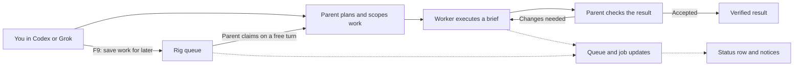
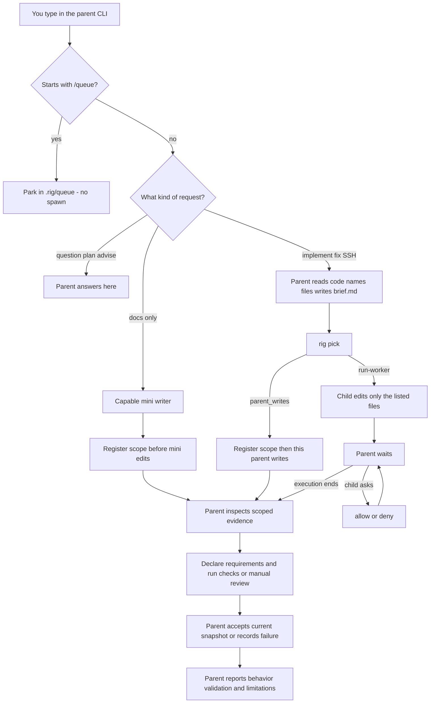
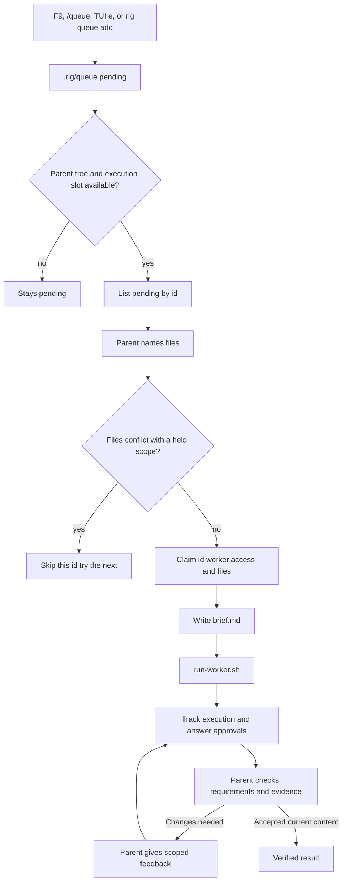

# Rig

Rig coordinates local coding agents from the CLI you already use. You describe the work to a **parent** agent; it scopes tasks, delegates to **workers**, checks their results, and gives feedback. Rig keeps the queue, job progress, and file ownership in your project.

Intended parent is **Codex running Astra** (the human-like assistant). Grok, OpenCode, OMP, Pi, and agy can also be the parent. Claude and Cursor are never the parent. Missing worker binary → cheaper same-CLI. That is success.

## Rig at a glance



**With the optional terminal companion:** open plain `codex` or `grok`, see progress in a compact status row, press **F9** to queue another task, and **F8** to manage jobs. It works independently of the parent's prompt processing. The parent still decides when to claim and execute queued work.

For example: while a worker fixes login, press F9 and save “Add regression tests next.” The task stays pending; you return to the parent, and it claims the task when free and its file scope is available.

Start with [installation](#install), [project setup](#per-project), and [the terminal companion](#optional-terminal-companion). See the [visual flow guide](docs/rig-flow.md) for the complete journey and cancellation behavior.

## Why

Using AI to ship a feature often means **you** become the bottleneck. You read every diff. You write every correction. You get tired. The work stops being smooth.

Sol made an agent feel like a person at the computer. Astra went further. Rig is the harness around that:

1. You talk to the **parent** (Astra in Codex, or another parent CLI you opened).
2. The parent assigns the task to a **child** (Grok, Claude, Cursor, OpenCode, OMP, Pi, agy, Codex).
3. The parent **checks, verifies, and gives the child feedback** (`rig jobs`, allow/deny, a follow-up prompt) — the same review loop you used to run by hand.

Open Codex on Astra as the parent. Pick the parent model in that CLI. Worker models come from `rig pick`. Never spawn Astra, Sol, or Fable as a child.

## What you get after setup

After `rig setup` + fully quit the parent once:

| Surface | What it does |
| --- | --- |
| `/queue …` in Grok, Codex, OpenCode, OMP, Pi | Parks work in **this repo’s** `.rig/queue/`. Does **not** spawn a child. Codex: `/plugins` **Rig Queue** then `/hooks` trust (0.154 has no `/prompts:queue` slash). |
| HUD | Grok/agy statusline, OMP/Pi widget under the editor, OpenCode sidebar/footer. Shows QUEUE + live/ASK. For Codex, use the optional terminal companion below or `rig tui`; the native hook provides a queue receipt. |
| Optional shell UI | `rig setup --shell-ui` adds a tmux status row to interactive `codex`/`grok` launches. F8 opens Jobs/Queue/Notices; F9 adds work while the parent runs. Requires tmux 3.3+. |
| Drain | On a **free** parent turn the parent claims by **id**, names files, writes `brief.md`, then `run-worker.sh`. HUD refresh never spawns. |

Before updating an active repository, stop new admissions, finish or cancel existing work, confirm it stopped, and close or reconcile held reservations. Then update every launcher and fully restart all parent/MCP sessions. Mixed old/new admission writers are unsupported. See [safe rollout](docs/usage.md#safe-upgrade-and-rollback).

## How your prompt is handled

You type in the **parent**. Rig does **not** forward that chat as the child’s prompt. The parent chooses a semantic role and requests `rig_session(role=..., compact=true, terminal_limit=10, case=...)`. Questions and plans stay local. Work assigned to a child becomes a scoped `brief.md`; the chat itself is not forwarded. Full session output remains the API/CLI default.



| You type | What happens |
| --- | --- |
| `How does pick choose a worker?` | Stay. Parent answers. No child. |
| `Fix the failing tests in tests/test_cli.py` | Parent names files → brief → child (or `parent_writes`). |
| `/queue fix the sidebar after this job` | Park only. The running child is not interrupted. |
| `Review the diff I staged` | Standalone review; independence stays unknown unless actual writer provenance supports it. |

Details and walk-throughs: [Usage](docs/usage.md#how-your-prompt-is-handled).

## Why the queue exists

While the parent is busy, you can think of more work without wanting to interrupt its current turn. Use **F9** in the companion to save it directly to Rig; this entry does not wait for the host to process another chat prompt. On a free turn the parent claims, briefs, and spawns — up to 3 reserved/running/ASK executions when scopes permit. File protection continues through parent verification and review. Park does **not** spawn.

Longer why (two locks, without vs with): [Usage](docs/usage.md#why-the-queue-exists).

## How the queue works

Rig queue entries are saved tasks awaiting a parent claim. **F9**, supported `/queue` hooks, `rig tui` key `e`, and `rig queue add` all park work without launching a worker. A host’s own queued chat prompts remain separate; Rig does not change their timing.



Cap is `[queue].max_running` (default 3 reserved + running + ASK executions). A stopped job frees its execution slot while its files stay protected until accepted completion or explicit close. Read/read overlap is allowed; writers conflict with held writers and readers. Unknown write scope is exclusive. Claim **by id** when more than one item is pending. Mid-wait: companion **F9** / supported `/queue` / TUI `e` / `rig queue add` — never a second writer on the same files.

## Install

```bash
curl -fsSL https://raw.githubusercontent.com/Brasth/Rig/main/install.sh | bash
```

No GitHub login. It clones over HTTPS, copies into `~/.rig`, puts `rig` on `~/.local/bin`, runs `rig setup`, and deletes the temp clone. Same curl later is idempotent. It does **not** overwrite a project’s `.rig/harness.toml` or `.rig/MEMORY.md`.

First install and `rig update` also try to install or upgrade tmux to **3.3+**, using an existing Homebrew on macOS or apt-get/dnf on Linux. Compatible tmux is left alone. Package operations are noninteractive; if unavailable or unsuccessful, Rig installation continues with manual instructions. Set `RIG_SKIP_TMUX_INSTALL=1` on the installer or `rig update` to opt out. The terminal companion still requires explicit opt-in below.

Already have `rig` on PATH: `rig update` (GitHub `main`, same installer). Older `rig` without that command still needs the curl once.

From a checkout you already have: `./install.sh` (copies the local tree + `rig setup`, no clone).

**PATH (only if `rig` is not found):**

```bash
export PATH="$HOME/.local/bin:$PATH"
echo 'export PATH="$HOME/.local/bin:$PATH"' >> ~/.zshrc
source ~/.zshrc
```

`which rig` must print `$HOME/.local/bin/rig`.

You need one parent CLI: Codex, Grok, OpenCode, OMP, Pi, or agy. Optional worker binaries: `grok`, `claude`, `cursor-agent`, `codex`, `opencode`, `omp`, `pi`, `agy`.

## Optional terminal companion

With tmux 3.3+ installed, opt in once:

```bash
rig setup --shell-ui
# Open a new shell, then use your usual command in an initialized repo:
codex
# or: grok
```

The parent keeps the terminal; one status row shows observed work, queue count, and attention even with the manager closed. Brief notices announce milestones and requests for attention.

| Control | What you get |
| --- | --- |
| Status row | Working/reserved counts, queued items, attention, and latest reported activity |
| F8 | Jobs / Queue / Notices, job details, approvals, and stop requests with confirmation |
| F9 | Queue editor available while the parent runs |
| Esc in queue editor | Close and retain the draft; the parent and accepted actions continue |

The popup is temporary; there is no permanent side panel. Queue additions wait for the parent to claim them. The view covers this repository or worktree, including work from other parent sessions. These companion controls support **Codex and Grok** first; other hosts remain on the companion roadmap.

Bash and zsh are supported. Setup preserves existing `codex`/`grok` aliases and functions, and reports when they prevent integration. For custom startup files: `rig setup --shell-ui --shell zsh --rc-file /path/to/rc`. Headless commands and workers retain their usual behavior.

`rig ui disable` makes new launches bypass the companion, including functions already loaded in a shell. `rig ui enable` restores it. `rig ui sessions` lists companion sessions; `rig ui attach ID` reconnects. See [terminal companion and removal](docs/usage.md#optional-terminal-companion) for controls, startup files, and safe uninstall.

## Per project

```bash
cd your-repo
rig init
rig doctor
```

`rig init` is per repo. Do this in every project you want Rig to manage. Existing `.rig/harness.toml` flags are never flipped.

Fully quit the parent CLI once after first install (not just the tab — quit the apps). MCP tools and the Grok status line load on a cold start.

Open a **new** thread in that repo. An already-open session will not pick up `AGENTS.md` or skills.

Type a normal prompt in that parent CLI. Example: `fix the failing tests in tests/test_cli.py`. Do **not** use `rig run` for normal work.

## Configure

```bash
rig use grok|codex|opencode|omp|pi|agy
rig workers grok=on|off claude=on|off codex=on|off cursor=on|off opencode=on|off omp=on|off pi=on|off agy=on|off
```

```toml
parent = "codex"
# parent = "grok"
# parent = "opencode"
# parent = "omp"
# parent = "pi"
# parent = "agy"

[workers]
codex = false
grok = true
claude = true
cursor = false
opencode = false
omp = false
pi = false
agy = false
```

- **Live parent** is whichever Codex, Grok, OpenCode, OMP, Pi, or agy you actually opened (`rig status`). The `parent =` key is only the preferred default (`rig use grok|codex|opencode|omp|pi|agy`). Opening the CLI is what makes it live.
- Parent **model** is the CLI’s model. Worker models come from `rig pick`. Never spawn Sol, Astra, or Fable as a child.
- A worker is **effective** only when: flag true **and** binary on PATH **and** not the live parent.
- Claude Code and Cursor are never the parent.
- Grok Bot.app and Cursor.app are GUIs, **not** spawnable workers. The Cursor worker binary is `cursor-agent`.

## Watch

- Inside Codex/Grok: optional companion status row, **F8** manager, **F9** queue editor
- Separate board: `rig tui` / `rig jobs` / `/rig`
- Park: `/queue …` (see table in [Usage](docs/usage.md#watch-jobs-memory)) or `rig tui` key `e`
- HUD: Grok/agy statusline, OMP/Pi widget, OpenCode sidebar. Codex native queue hook: `/plugins` **Rig Queue** then `/hooks`; companion UI is enabled separately
- Pi `/rig` also needs `pi install npm:pi-mcp-adapter`

Jobs and MEMORY are this repo, not the chat. A new thread still sees `.rig/jobs`. Esc/Stop on **this wait** records durable cancellation for its attached job attempts and returns promptly. Pending queue items and unattached jobs stay. After explicit cancellation, do not re-wait, re-pick, or drain queued work automatically.

`stop-unconfirmed` and `native-cancel-required` mean execution is not yet confirmed stopped. Rig cannot interrupt a host-native agent itself; its owning host must interrupt that agent and report authenticated completion. Unconfirmed work keeps its slot and files. After cancelled execution is confirmed stopped, explicitly close it to release its files. A transport failure alone preserves workers: take one bounded status snapshot with `rig job wait ID --timeout 0`, then inspect or reconcile.

In `rig tui`, Tab switches Jobs/Queue; `e` opens the Unicode queue editor, Enter saves, and Esc cancels the draft. Drafts survive a failed save. `x` cancels the selected job or queue item, `l` toggles the activity view, and `q` exits the board without stopping jobs. Snapshots and actions run in the background; the board shows snapshot age and refresh errors.

Parent orchestration is MCP (`rig_session`, `rig_job_wait`, `rig_job_allow` / `rig_job_deny`, requirement/check/accept tools). Launching a child is still `run-worker.sh`. Claude `ask` → allow/deny; never kill that job.

Execution `ok` means the worker exited successfully. **Verified** means the parent accepted the current scoped content against its requirements; later edits invalidate that acceptance. Job details show actual model provenance, held reservations, checks, and independent-review status separately. Never infer verification from a successful exit.

More: [Visual flow guide](docs/rig-flow.md) · [Usage](docs/usage.md) (prompt routing, queue scenarios, setup, doctor, troubleshooting).
Parent spawn protocol: `.agents/skills/delegate-harness/SKILL.md` (also the `<!-- rig:start -->` block in `AGENTS.md`).
