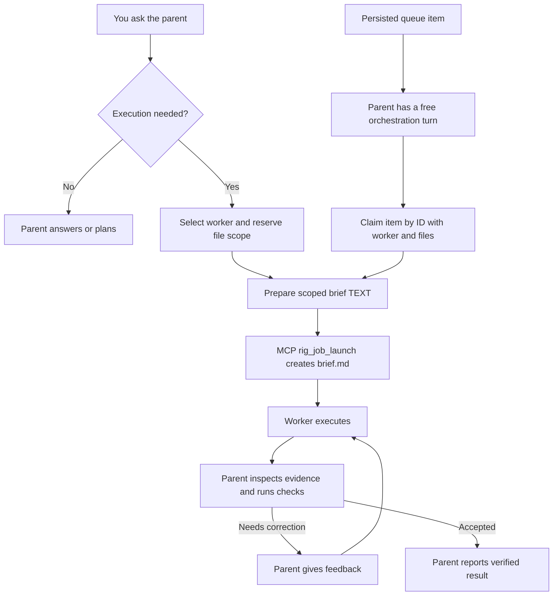
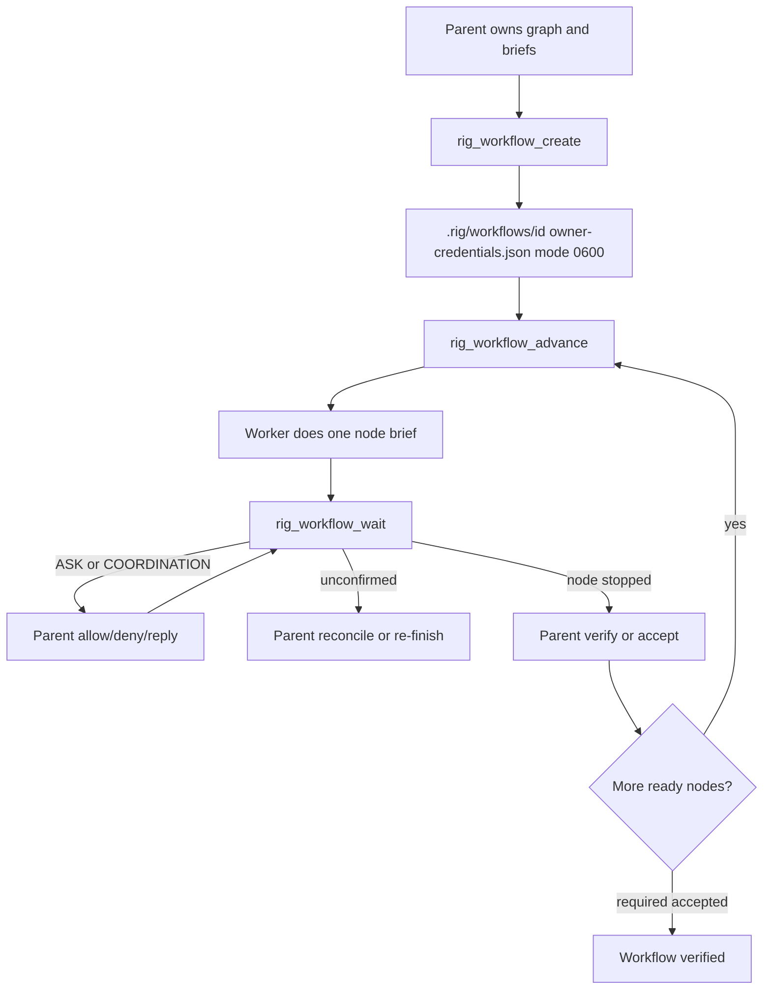
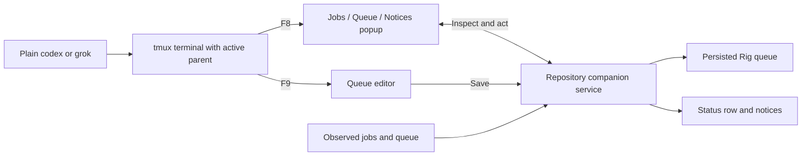

# Rig flow

Rig lets you stay with one parent agent while it assigns work, checks the result, and gives feedback. Your usual Codex or Grok conversation remains the place to describe the outcome you want. The optional terminal companion lets you watch jobs and park more work while that parent is busy.

## Start with your usual command

After installing Rig, initialize each repository with `rig init`. Installation and `rig update` attempt to provide tmux **3.3+**; follow their manual instructions if needed. To add the companion, enable the bash/zsh integration once:

```bash
rig setup --shell-ui
# Open a new shell in an initialized repository.
codex
# Or launch: grok
```

Plain interactive `codex` and `grok` launches then open with a Rig status row. Existing aliases/functions are preserved; setup reports conflicts. See [setup and controls](usage.md#optional-terminal-companion) for custom startup files and removal.

## From request to checked result

The parent reads your request and decides what work is needed. Questions and planning can stay in the conversation. For execution, it selects a worker, names the files involved, and reserves that scope before edits begin. Queued work is claimed by item ID. The parent prepares brief TEXT and passes it to `rig_job_launch`, which creates the focused `brief.md` the child receives.



If selection returns `parent_writes`, the parent registers its scope and does the work itself. A successful worker exit means execution finished; **verified** means the parent accepted the current scoped result against its requirements. Further edits can invalidate acceptance.

Desktop computer-use stays on the parent. Call Cua Driver only when this repo `[computer-use] enabled=true` and `cua-driver` is on PATH, via Rig MCP `rig_cu_capture` / `rig_cu_act` / `rig_cu_confirm` / `rig_cu_record` (capture → one act on a fresh 30s `element_token` → mandatory confirm). That loop is semantic Astra parity: the parent inspects a visual observation (MCP image when the PNG is readable) plus a Rig-owned `rig.cu.v1` receipt. It is not Astra wire-format cloning and does not give CUA to workers. Confirm is the only `confirmed` outcome and yields a fresh successor snapshot. Expired, consumed, unknown, or confirm-before-act operations return `capture_required` / stale and do not call Driver. AX token first; px only after `degraded` / `escalate_px` on that snapshot. Named Chrome profile: parent `chrome-profile` open, then Driver existing-profile bind. Isolated profile is not the Figma path. Existing-profile grant is human (`cua-driver serve --grant existing-profile`); Rig never silent-grants. Otherwise chrome-devtools. Never Figma MCP or Playwright as computer-use fallback. Figma MCP remains parent file/node. Never the Hermes `computer_use` skill. Children never receive cua-driver or chrome-devtools MCP. Children never receive chrome-profile or `rig_cu_*`. Do not spawn a clicker.

Parent-only BrowserSkill is the logged-in Chromium lane. Call it only when this repo `[browser-skill] enabled=true`, machine `~/.rig/browser-skill.json` opt_in=true, `bsk` on PATH, and the extension is connected, via Rig MCP `rig_bsk_status` / `rig_bsk_session` / `rig_bsk_observe` / `rig_bsk_act` / `rig_bsk_confirm` (`bsk session start --json`, optional `--no-focus`; retain `session_id`; `--session` on every scoped command; `session stop` with positional ID; observe → one click/fill/press on a fresh `@eN` ref → confirm; `rig_bsk_navigate` plus explicit tab list/borrow/return). nonempty `status.browsers` is connected. Never run `bsk install-skill`. Website + real cookies → BSK. Native / canvas px → Driver. Neither effective → chrome-devtools. One backend per turn. Children never receive `bsk` or `rig_bsk_*`.

When `[orchestration] mode = "adaptive"` (default; `max_nodes` 12), the parent decomposes eligible work into a DAG under `.rig/workflows/<id>/` (`spec.json`, `state.json`, `events/`, `owner-credentials.json` mode 0600). `single` keeps one-job behavior. Queue and worker caps remain authoritative. The parent owns the graph, briefs, and acceptance and uses `rig_workflow_advance` / `rig_workflow_wait`. Children never spawn or message children. `verify` is parent/final integration; `review` is independent post-write review (independent review unavailable stays explicit). Review+seed and parallel writers require file AND resource disjointness. Overlapping writer scopes are rejected, not sequenced. No estimated progress, savings, or ETA.



Reservations prevent conflicting work from being admitted. The default cap is three reserved/running/ASK executions. A stopped execution frees its slot, but its files remain protected through verification or explicit close. Wrapper stop requires the isolated worker and in-tree descendants. Reparented leftovers are orphans; they do not block stop or hold the slot, and must not be killed on success. Unconfirmed stop is not `running`; `rig_workflow_wait` returns on attention so the parent can inspect `next_parent_action`. See [protected writes and acceptance](usage.md#protected-writes-and-parent-acceptance) and [adaptive workflows](usage.md#adaptive-workflows).

`rig_job_launch` public text includes the issued `credentials_path` plus non-secret identifiers (`job_id`, `reservation_id`, `attempt_id`, `wrapper_pid`, `status`). It never prints `owner_token`. Parent ownership tools (`close`, `accept`, checks, finish, and the same family) accept that path instead of a raw reservation/attempt/token triple. The server resolves only the canonical `.rig/jobs/<id>/owner-credentials.json` in this repository after it is a regular, non-symlink mode 0600 file, valid JSON, bound to that job/reservation/attempt, and matched to the active reservation. Direct raw credential callers keep working.

If the launch receipt is lost, parent-only `rig_job_recover_wrapper_receipt` returns the same non-secret metadata, including `credentials_path`, for a confirmed-stopped wrapper. It rejects released scopes, active work, missing, malformed, insecure, or mismatched artifacts, and non-wrapper executions. It does not accept, close, release, mutate a reservation, or invent a token. Never reconstruct `owner_token` from the artifact or from a guessed job id.

Ordinary authenticated close is unchanged: `rig_job_close` / `rig job close` still requires the ownership triple or a validated `credentials_path` plus rationale, and still releases only confirmed-stopped work.

Parent-only **break-glass close** is a separate audited path for a **confirmed-stopped failed or cancelled wrapper** when the original session cannot perform ordinary close. It requires the canonical mode-0600 `.rig/jobs/<id>/owner-credentials.json` path, `confirmed_stopped=true`, and a rationale. It validates the current job/reservation/attempt binding, wrapper executor, stopped state, and that verification is neither active nor accepted. It atomically releases only that scope, writes redacted `breakglass-recovery.json` evidence, and is idempotent. It never accepts raw `owner_token` / reservation / attempt arguments and never prints tokens.

```bash
rig job break-glass-close <id> --credentials-path PATH --confirmed-stopped --rationale TEXT
```

MCP: `rig_job_break_glass_close` with `id`, `credentials_path`, `confirmed_stopped`, and `rationale`.

## Observed tokens and actual invoice dollars

Token usage is observed-only and actor-aware (`parent`, `wrapper`, `native_child`). Unknown values stay omitted; totals and USD are never inferred from tokens.

Actual invoiced USD lives in a provider-neutral ledger under `.rig/billing/`. Named scopes/cohorts hold receipts with provider, period, exact USD, currency, source identity, and import evidence. Credential **references** are allowed; secrets are not. OpenAI and Anthropic have first-class read-only adapters (network opt-in, dry-run/validate). Every other provider uses generic receipt import.

Benchmark reporting requires paired baseline and Rig tasks and **20 matched completed pairs** before any savings conclusion. It reports cohort dollars and tokens separately, coverage/missing data, and the quality gate. It makes no savings claim unless quality is non-inferior and actual costs are comparable/covered. If the provider reports only cohort aggregates, dollars cannot be assigned to individual jobs.

Commands and the 20-task procedure: [Cost accounting](cost-accounting.md).

## While the parent is busy

The companion observes repository state independently of the host's model turn. Its status row shows work, queued items, attention, freshness, and workflow active/attention counts (`wf`, `wf!`). **F8** opens Jobs / Queue / Notices. **F9** opens the queue editor, so you can park a new task without waiting for the parent to finish its current turn. Notices distinguish approval requests, finished execution, verification, stop progress, and workflow attention/blocked/cancel-requested/failed/verified/started; history remains in the popup after a brief status message expires. `rig tui` Tab Jobs/Queue/Workflows shows workflow id, status, accepted/required, running, ASK, blocker, next parent action, and title. No estimated progress, savings, or ETA.



The parent stays in the main terminal; there is no permanent side panel. Esc leaves the editor draft available for later, and closing the popup restores the parent view. Sessions using the same repository root share observed jobs and pending items. Another repository or worktree uses its own root and Rig state; this is not a global board across projects.

| What you use | Where the work goes | What starts execution |
| --- | --- | --- |
| Host's native prompt queue | Managed by that CLI for its conversation | Host behavior; not a Rig claim |
| Rig F9, popup `e`, `/queue …`, or `rig queue add` | This repository's persisted `.rig/queue/` | Parent later claims, prepares brief TEXT, and MCP-launches on a free turn |

Typing into a host's native prompt queue is not a receipt for a Rig queue item. Host submit hooks also depend on when that host processes input. F9 talks directly to the companion service and returns a saved queue receipt independently of the parent's turn. `/queue` availability varies by host; see the [adapter table](usage.md#watch-jobs-memory).

Parking, refreshing the status row, and opening a popup **never dispatch workers**. Pending items remain until the parent handles them or you cancel them. The companion does not forward your chat or act as another parent.

## Closing, cancelling, and stopping

| Action or state | Meaning |
| --- | --- |
| Close the popup | Return to the parent view. Jobs continue; accepted actions remain accepted. |
| Cancel a pending queue item | Remove that item from pending work. This does not stop a running job. |
| Request stop for a selected job | Record cancellation for that job; inspect the result for confirmed termination. |
| `stop-unconfirmed` | Stop was requested, but execution is not yet confirmed stopped. Slot and files remain held. |
| `native-cancel-required` | The owning host must interrupt its native agent and report authenticated completion. |
| Confirmed stopped | Execution slot is free; explicitly close cancelled work to release held files. |

Closing a popup does not undo a submitted action. If an action receipt becomes uncertain after an observer restart, inspect the item before retrying. After explicit cancellation, the parent must not automatically re-wait, re-pick, or drain pending work. Combined rollout with wait-cancel: stop new admissions, finish or cancel, confirm stopped, accept or close scopes, preserve data, update every launcher and protocol, then fully restart. Rollback sets `[orchestration] mode = "single"` and never deletes data. See [recovery](usage.md#queue-ownership-and-recovery) and [safe upgrade](usage.md#safe-upgrade-and-rollback).

## Session-local mouse (companion)

Mouse is session-local only (no global/root tmux changes). Wheel in the main parent pane controls scrollback history: WheelUp enters `copy-mode -e` and scrolls five lines immediately; WheelDown is consumed outside copy-mode; returning to the live bottom exits copy-mode. Keyboard Up/Down history remains. F8/F9 and popups are unchanged. Requires an updated Rig runtime and a companion session restart. Manual mouse/trackpad acceptance on Codex+Grok (private/nested tmux, alternate screen, detach) remains a physical check, not covered by this suite.

## Companion coverage

The optional shell companion currently supports **Codex and Grok**. Codex has no native Rig HUD panel; the companion supplies the status row and popups outside the host UI. Other supported parents retain their existing adapters and HUDs. Companion support for OpenCode, OMP, Pi, and agy is roadmap work, not an installed feature.

Continue with [daily use](usage.md#daily-use), [queue scenarios](usage.md#scenarios), or the [README](../README.md).
