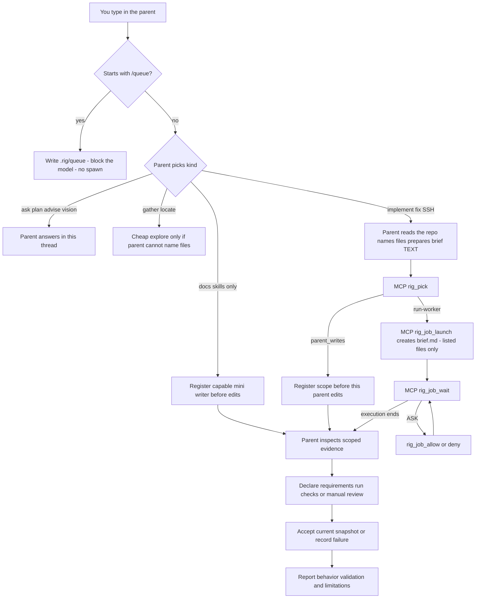
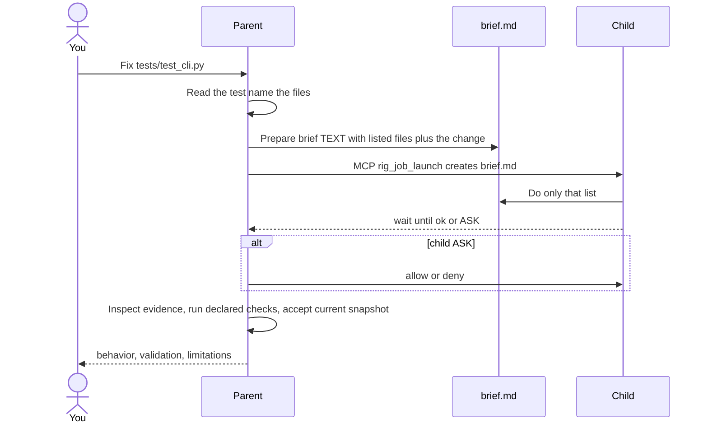
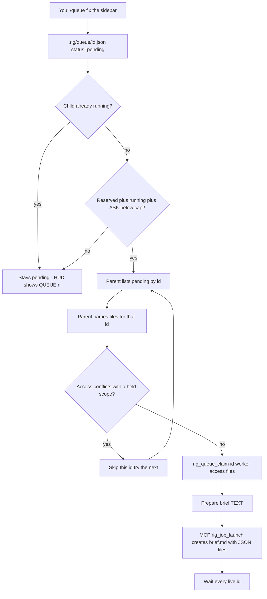

# Rig usage

Start here: [Rig flow](rig-flow.md) (parent, workers, queue, and terminal companion). Landing page: [README](../README.md).

In this file: [terminal companion](#optional-terminal-companion) · [diagram preview](#diagram-preview) · [protected writes and acceptance](#protected-writes-and-parent-acceptance) · [adaptive workflows](#adaptive-workflows) · [recovery](#queue-ownership-and-recovery) · [safe rollout](#safe-upgrade-and-rollback) · [how your prompt is handled](#how-your-prompt-is-handled) · [why the queue](#why-the-queue-exists) · [queue](#how-the-queue-works) · [scenarios](#scenarios) · [install](#install) · [daily use](#daily-use) · [watch](#watch-jobs-memory) · [troubleshooting](#troubleshooting).

## What Rig is

The point is to stop you being the tired reviewer of one agent. You talk to a **parent** (intended: Codex on Astra). The parent assigns work to a **child**, then checks and sends feedback — allow/deny, another prompt — the loop you used to do yourself.

You stay in **one parent**: Codex, Grok, OpenCode, OMP, Pi, or agy. You talk to that parent. The parent picks **kind** and assesses complexity, risk, and uncertainty. `rig pick` selects an eligible model+effort profile at the minimum sufficient tier. Never spawn Astra, Sol, or Fable as a child.

- **Parent** (you open this): Codex, Grok, OpenCode, OMP, Pi, or agy. It plans, checks, talks to you, does vision / computer-use / chrome-profile, and watches jobs. It does **not** sit on write/review/SSH when a worker is effective.
- **Workers** (the parent may spawn these): Grok, Claude Code, Cursor CLI, OpenCode, OMP, Pi, agy, Devin, Codex. They write code, fix bugs, review, SSH/debug, and gather facts.
- **Never the parent:** Claude Code, Cursor, and Devin. Opening those CLIs does not make them the Rig parent. The Antigravity IDE/GUI is not a parent or worker; the CLI is `agy`. Devin is a child-only SWE-2 worker.
- **Live parent** is whichever Codex, Grok, OpenCode, OMP, Pi, or agy you actually opened (`rig status`). The `parent =` key in `.rig/harness.toml` is only the preferred default (`rig use grok|codex|opencode|omp|pi|agy`). Opening the CLI is what makes it live.
- **Missing binary is not a failure.** That worker is off. The parent uses a cheaper same-CLI worker. That is success.

**You need** one parent CLI: Codex, Grok, OpenCode, OMP, Pi, or agy. Optional worker binaries: `grok`, `claude`, `cursor-agent`, `codex`, `opencode`, `omp`, `pi`, `agy`, `devin`.

Grok Bot.app and Cursor.app are GUIs, **not** spawnable workers. `rig doctor` may list them under **Apps (not spawnable)** as a hint. The Cursor worker binary is `cursor-agent`, not the GUI.

Codex CLI and Grok CLI are installed from those products (this guide does not pin their installer URLs). Optional worker CLIs:

```bash
curl https://cursor.com/install -fsS | bash
curl -fsSL https://opencode.ai/install | bash
curl -fsSL https://omp.sh/install | sh
npm install -g @earendil-works/pi-coding-agent
curl -fsSL https://antigravity.google/cli/install.sh | bash
```

## Install

```bash
curl -fsSL https://raw.githubusercontent.com/Brasth/Rig/main/install.sh | bash
```

That one line is the install. `| bash` is required. No GitHub login.

What that does:

- No GitHub login. `curl` pipes `install.sh` into bash.
- `install.sh` clones `https://github.com/Brasth/Rig.git` over HTTPS into a **temp** dir (needs `git`; if HTTPS clone fails and `gh` is logged in, it tries `gh repo clone`).
- Attempts to install or upgrade tmux to **3.3+** using existing Homebrew (macOS), apt-get, or dnf (Linux); skips compatible tmux.
- **Asks** whether to install Cua Driver for parent computer-use (default **No**). Piped `curl | bash` has no TTY and skips unless `RIG_INSTALL_CUA_DRIVER=1`. Decline is remembered in `~/.rig/cua-driver.json`. Missing Driver does not fail Rig. Skip this run with `RIG_SKIP_CUA_DRIVER=1`. After a yes, run `rig computer-use setup` in a repo to wire parent MCP.
- Copies bin, scripts, skills, adapters, and templates into `~/.rig`.
- Symlinks `~/.local/bin/rig` → `~/.rig/bin/rig`.
- Runs `rig setup`.
- Deletes the temp clone. There is **no local clone to keep**.

From a checkout you already have: `./install.sh` (same copy + `rig setup`, no clone). That is the **dev** path; it copies the local tree, not GitHub `main`.

Before updating an active repository, follow [safe upgrade and rollback](#safe-upgrade-and-rollback). Update an existing machine: `rig update`. That fetches GitHub `main` through the same `install.sh` (not your checkout). The same `curl | bash` still works (idempotent). An older `rig` without `update` still needs the curl once. It updates the skill and scripts. It does **not** overwrite project `.rig/harness.toml` or `.rig/MEMORY.md`. It already runs `rig setup`.

Tmux package operations are noninteractive and time out after five minutes per operation. Linux needs root or passwordless sudo. Missing package managers, permissions, or a suitable package produce manual recovery instructions and allow Rig installation to continue. Set `RIG_SKIP_TMUX_INSTALL=1 ./install.sh` or `RIG_SKIP_TMUX_INSTALL=1 rig update` to manage tmux yourself; for the piped installer, use `curl -fsSL https://raw.githubusercontent.com/Brasth/Rig/main/install.sh | RIG_SKIP_TMUX_INSTALL=1 bash`. The companion remains opt-in; explicit `--shell-ui` still fails if tmux 3.3+ is unavailable.

**`rig setup` writes:**

- `~/.rig` (bin, scripts, skills, adapters, templates)
- Skill links in `~/.agents/skills`, `~/.grok/skills`, `~/.codex/skills`, `~/.config/opencode/skill`, `~/.omp/agent/skills`, `~/.pi/agent/skills`, `~/.gemini/antigravity-cli/skills` (`delegate-harness`, `rig-jobs`, `rig-queue`, parent-only `computer-use`, `style-guide`, and `computer-test`)
- Codex `~/.codex/hooks.json` UserPromptSubmit (parks `/queue` / `$queue` and **blocks** the model; trust once with `/hooks`) plus leftover `~/.codex/prompts/queue.md` (not a 0.154 slash). After `/plugins` install **Rig Queue**, setup drops the duplicate hooks.json entry. OpenCode park plugin `~/.config/opencode/plugins/rig-queue.js` and TUI HUD `tui.json` → `tui-plugins/rig-hud.tsx` (file path, not npm). OMP/Pi extensions `~/.<omp|pi>/agent/extensions/rig-queue.js` (`/queue` even while streaming; HUD under the editor).
- Codex agent files under `~/.codex/agents` when they are Rig agents
- Grok bottom status line (`[ui.status_line]` → `rig-statusline` with QUEUE; restart Grok once). agy `statusLine.command` in `~/.gemini/antigravity-cli/settings.json` (skip if you already have a custom line; `/statusline` if the row is hidden).
- `[mcp_servers.rig]` in `~/.grok/config.toml` and `~/.codex/config.toml` **even if those files did not exist**
- `mcp.rig` in `~/.config/opencode/opencode.json` (or `mcp.servers.rig` if that map already exists)
- `mcpServers.rig` in `~/.omp/mcp.json`, `~/.pi/agent/mcp.json`, and `~/.gemini/config/mcp_config.json`
- Codex sandbox writable roots so Grok/Claude/Cursor/OpenCode/OMP/Pi/agy children can write sessions (`[sandbox_workspace_write]`)

Setup does **not** write project `mcp.json` / `opencode.json`. Setup does **not** add `pi-mcp-adapter` to Pi `settings.json`. `rig setup --cua-driver` / `--no-cua-driver` forwards to the Cua Driver installer. `rig computer-use setup` is the complete machine path (binary + parent MCP on an isolating parent CLI + Cua skill pack). It does **not** write `cua-driver` into a CLI that cannot isolate children (Grok print-mode, OpenCode, Pi); those parents use `cua-driver call`. It never writes Driver into worker CLI configs.

## Computer-use (parent)

Cua Driver is parent-only eyes and hands. Never a Rig worker. Never `[workers].cua`. Children never receive cua-driver or chrome-devtools MCP.

Effective on = machine `~/.rig/cua-driver.json` `opt_in=true` **and** `cua-driver` on PATH **and** this repo `[computer-use] enabled=true`. Anything else: **chrome-devtools** only. Never Figma MCP or Playwright as the computer-use fallback. Never the Hermes `computer_use` skill.

When Driver is effective, every legal parent (Grok, Codex, OpenCode, OMP, Pi, agy) uses Rig MCP `rig_cu_capture` → `rig_cu_act` (fresh `element_token`) → `rig_cu_confirm`, and `rig_cu_record` for session video. AX token first; px only after `degraded` / `escalate_px` on that snapshot. Named Chrome profile: parent `chrome-profile` open, then Driver existing-profile bind. Isolated profile is not the Figma path. Existing-profile grant is human (`cua-driver serve --grant existing-profile`); Rig never silent-grants. Figma MCP remains parent file/node, not a clicker. Put the returned `brief_block` in the worker brief. Do not spawn a clicker. Do not call raw cua-driver MCP or shell cua-driver for that loop.

Real GUI tests (click the live UI, pass/fail, record `recording.mp4`) stay parent: `skills/computer-test/SKILL.md`. Desktop drive: `skills/computer-use/references/desktop-drive.md`. Logged-in Chrome: `logged-in-browser.md`. Video: `skills/computer-test/references/record-video.md` (`rig_cu_record` under `.rig/cu-evidence`). Never Playwright as computer-use.

Recreating a Figma, canvas, or screenshot as UI is still parent vision + CU. Web: `skills/computer-use/references/figma-to-code.md`. Mobile/native: `figma-to-mobile.md`. Screenshot only: `screenshot-to-ui.md`. Follow `skills/computer-use/SKILL.md` and the matching reference: inventory every layer, record spacing and gap for every section and item (nested auto-layout padding/gap plus sibling space — not only the outer frame), record colours (every fill, text, stroke, effect) and typography (every text layer), download every image into the codebase assets folder (MCP/node export, then native Export, then high-zoom crop — never a generated/SVG/emoji stand-in; reuse `src/assets`, `public/`, or the repo’s existing folder), record inspect tokens, write the style-guide token config (`skills/style-guide/SKILL.md`) for colours, spacing, and typography as CSS variables, Sass maps, or Tailwind config (`theme.extend` / `@theme`) — follow the codebase’s own style-guide skill or rule when present; if a token config already exists, reuse it and do not create a new or custom file, then iterate until an HTML screenshot at the frame size matches the Figma frame screenshot. Put those files, the spacing / colour / type tables, and the token file in the worker brief.

```bash
rig computer-use              # machine + this-repo + MCP + effective
rig computer-use setup        # install/upgrade binary, wire parent MCP if isolation exists
rig computer-use on           # this repo [computer-use] enabled=true
rig computer-use off          # this repo enabled=false; does not uninstall the binary
rig computer-use doctor       # also folded into rig doctor
```

`rig init` writes `enabled = false`. Two repos on one machine can disagree. `on` with no binary writes the flag and warns; the parent still uses chrome-devtools until setup succeeds.

Success print:

```text
install ok  rig -> $HOME/.local/bin/rig
next: cd your-repo && rig init && rig doctor
```

If PATH is missing `~/.local/bin`, the installer also prints:

```text
add to PATH: export PATH="$HOME/.local/bin:$PATH"
```

Then persist it for zsh:

```bash
export PATH="$HOME/.local/bin:$PATH"
echo 'export PATH="$HOME/.local/bin:$PATH"' >> ~/.zshrc
source ~/.zshrc
```

Confirm the binary:

```bash
which rig
```

That must print `$HOME/.local/bin/rig` (for example `/Users/you/.local/bin/rig`). If it is empty, PATH is still wrong.

## Optional terminal companion

The installer attempts to provide tmux **3.3 or newer**; install it manually if that attempt was unavailable. Then run `rig setup --shell-ui`. The version check must pass before shell startup files or the enable marker change. Open a new shell, run `rig init` in the project if needed, and launch plain `codex` or `grok`.

The parent occupies the main terminal. A tmux status row shows observed activity, queue count, attention, and snapshot freshness. The observer runs independently of the parent's turn; it neither forwards prompts nor starts workers. Milestones distinguish finished execution from verified results, and stop requests from confirmed termination. Notices remain available in the popup after their brief status-row display expires.

| Control | Action |
| --- | --- |
| F8 | Open Jobs / Queue / Notices popup |
| F9 | Open queue editor immediately |
| Tab | Switch popup tabs |
| Arrows or j/k | Select a row |
| Enter on job | Inspect activity and current approval details |
| e | Add queue text; Enter saves, Esc keeps the draft for later |
| x | Cancel a pending queue item, or request stop for the selected job after confirmation |
| y / n in details | Allow / deny the inspected approval request |
| a | Acknowledge notices for this terminal session |
| Esc | Close the current popup view and return to the parent |

Queue submission uses a durable receipt and a stable submission ID. Closing a popup does not cancel an accepted action. If the observer restarts during an action, an uncertain receipt stays explicit; inspect the item before retrying. Pending queue cancellation checks that the item is still pending. Native work that Rig cannot interrupt remains `native-cancel-required`; use its owning host to stop it.

If your terminal intercepts F8/F9, set `RIG_UI_MANAGER_KEY` and `RIG_UI_ADD_KEY` before launching a new companion, for example `RIG_UI_MANAGER_KEY=F6 RIG_UI_ADD_KEY=F7 codex`. Bindings accept F1–F12 or a letter/digit, optionally prefixed by C-, M-, or S-. Invalid or identical bindings fall back to F8/F9; the status row shows the selected bindings.

The integration installs nonexported shell functions, with no replacement `codex` or `grok` executable on PATH. Existing aliases/functions are preserved with a warning. Only interactive TTY launches in initialized repositories are eligible; headless subcommands, worker invocations, and unknown argument forms run normally. Missing tmux at launch falls back to the parent. A running companion suppresses the duplicate Grok native Rig status line for that launch only.

For zsh, the default startup file is `$ZDOTDIR/.zshrc` when `ZDOTDIR` is set, otherwise `~/.zshrc`. Bash setup covers `~/.bashrc` and the first existing login file among `.bash_profile`, `.bash_login`, and `.profile` (creating `.bash_profile` if none exists). Symlinks remain symlinks; their target content is journaled. Choose an explicit file when your shell has a custom startup arrangement:

```bash
rig setup --shell-ui --shell zsh --rc-file /path/to/custom-rc
rig ui disable             # loaded functions also bypass Rig on their next call
rig ui enable              # checks tmux again; open a new shell if needed
rig ui sessions
rig ui attach SESSION_ID
```

Disabling affects future launches. Existing parent sessions continue. Detaching a tmux session keeps the parent alive for later attach; closing a popup does not detach or stop it. Session settings and shortcuts belong to the companion session, without changes to global tmux configuration. Session-local mouse: wheel in the main parent pane controls history — WheelUp enters `copy-mode -e` and scrolls five lines immediately; WheelDown is consumed outside copy-mode; returning to the live bottom exits copy-mode. `MouseDrag1Pane` selection on the Rig session custom key table preserves wheel/F8/F9. Private Rig server sets a local clipboard helper and `copy-command` only. On existing-server fallback after select/leave copy mode, F10 copies the latest tmux buffer using `-S` from the launch `TMUX` socket (private server still uses `-L rig-ui`); F10 is omitted when assigned to manager/add. No global/root/copy-mode table edits. Keyboard Up/Down history remains; F8/F9/popups unchanged. No global/root changes. Requires updated runtime and companion restart for session bindings — do not treat this as installed, global, or live-terminal accepted yet. Real Ghostty drag was not tested here (CUA app access disallowed). Manual mouse/trackpad Codex+Grok private/nested tmux/alternate-screen/detach acceptance is NOT RUN in the automated suite. The private Rig server uses a 25 ms Escape delay; an existing user tmux server retains its own delay, so Esc can respond later there.

## Diagram preview

Command: `rig diagram PATH [--ascii] [--popup] [--output PATH]`. Renders local Mermaid from `.mmd` / `.mermaid` files or markdown fenced blocks as terminal text (Unicode by default). `--ascii` is plain ASCII; `--popup` is a scrollable tmux `display-popup` with `less -S`; `--output PATH` saves text only and will not overwrite. Requires Node.js on PATH. Supported subset: flowchart, state, sequence, class, ER, XYChart — not every Mermaid type. No browser, CDN, or runtime network. This does not claim an inline Codex Mermaid renderer. Full notes: [diagram-preview.md](diagram-preview.md). Not claimed as installed or live-accepted yet.

### Remove installed integrations

```bash
rig uninstall --dry-run
rig uninstall
rig uninstall --repo /path/to/older-project
```

Setup records original file content and symlink targets before its first write, retaining those originals across updates. Uninstall restores integrations that still match the installed version, including registered project instructions and skills. `--repo` additionally visits a legacy project's marked Rig instructions. Exact managed blocks can be removed while retaining other edits; modified host configuration files are preserved as a whole and reported for manual cleanup.

Runtime files are removed only when ownership is established and no active lease, process reference, active or unreconciled registered reservation, or remaining configuration reference requires them. Older installs without ownership records, unavailable process inspection, and uncertain references produce partial cleanup with an explanation. Finish or reconcile work and close parent/MCP sessions before retrying removal. Installation, enabling, disabling, and uninstall share a lock with a bounded wait.

Project `.rig` jobs, queue, memory, reservations, and history remain. Host binaries, tmux, private uninstall metadata, and empty runtime directories remain. Keep modified settings under your control; uninstall does not delete an entire home or project directory.

## First-time machine

Install already ran `rig setup`. Re-run `rig setup` after you update Rig (`rig update` or the curl install does this for you).

1. Fully quit Grok, Codex, OpenCode, OMP, Pi, and/or agy **once** so MCP tools, `/queue` adapters, and HUDs load (quit the apps, then reopen).
2. Run `rig doctor`. MCP lines should show `[mcp_servers.rig]` for grok and/or codex, plus OpenCode/OMP/Pi/agy JSON MCP when those files exist. Devin uses a job-scoped `.devin/mcp_config.local.json` (restored after the job).
3. After setup, Grok gets a **bottom status line** with QUEUE. Restart Grok once if you do not see it. agy: `/statusline` if the row is hidden. OMP/Pi: widget under the editor. OpenCode: sidebar/footer from `tui.json` (file-path plugin). Codex: no native Rig HUD panel; `/plugins` install **Rig Queue**, then `/hooks` trust for parking. The optional [terminal companion](#optional-terminal-companion) adds the status row and F8/F9 controls.
4. Pi `/rig` also needs `pi install npm:pi-mcp-adapter` (setup writes `mcp.json` but does not install the package).

### What `rig doctor` should look like

`rig doctor` reports the installed root/version, repository configuration, live/preferred parent, effective workers, skill links, cached model catalogs, and MCP setup. Missing model catalog output is not a model probe or a worker failure.

How to read each section:

| Section | Good | Bad |
| --- | --- | --- |
| **RIG_HOME** | `$HOME/.rig` | empty / missing — `rig update` or re-run the curl install or `rig setup` |
| **repo** | the git repo you `cd`’d into | wrong directory |
| **harness** | `.rig/harness.toml` exists | `(missing — run: rig init)` |
| **version** | `v1 <sha>` from `~/.rig/VERSION` | `(unknown — run: rig update)` |
| **update** | `current` | `behind main — run: rig update` (omitted if offline or `RIG_SKIP_UPDATE_CHECK`) |
| **Parent live** | `codex`, `grok`, `opencode`, `omp`, `pi`, or `agy` when you are inside that CLI; `(none)` in a plain terminal is normal | you expected a parent but opened Claude/Cursor |
| **Parent preferred** | `codex`, `grok`, `opencode`, `omp`, `pi`, or `agy` from `rig use` | — |
| **Workers** | the ones you want show `effective=on` | see reasons below |
| **Apps** | GUIs listed or `(missing)` | do **not** treat these as workers |
| **Skill** | project `SKILL.md` plus symlinks under `~/.agents`, `~/.grok`, `~/.codex`, `~/.config/opencode/skill`, `~/.omp/agent/skills`, `~/.pi/agent/skills`, `~/.gemini/antigravity-cli/skills` | `(missing — run: rig init)` or `(missing — run: rig setup)` |
| **Scripts** | `run-worker: … (ok)` | missing — `rig setup` again; Rig itself is broken |
| **MCP** | `ready (schema; fully quit once…)` / `unavailable (reason)` / `cursor: excluded` | readiness = binary on PATH + enabled installed config with available launcher; Cursor always excluded; never call invalid/disabled config ready |
| **Model catalogs** | `opencode: N models` on a fresh cache hit (`~/.rig/cache/model-catalogs.json`) | omitted when cache is missing or stale — doctor does not wait on the four CLIs |
| **Watch** | reminder of `rig tui` / `rig jobs` / `/rig` / `/queue` in Grok, Codex, OpenCode, OMP, Pi, or agy | — |

**`effective=off` reasons** (printed in parentheses):

- `flag` — `[workers].<name>` is `false`. Turn on with `rig workers <name>=on`.
- `no binary` — flag is true but the CLI is not on PATH (`grok`, `claude`, `codex`, `cursor-agent`, `agy`, `devin`).
- `is live parent` — you opened that CLI as the parent, so it cannot also be a child this session (typical: Grok parent → Grok child off; OpenCode parent → OpenCode child off).
- MCP unavailable / excluded — binary or enabled config/launcher missing, or Cursor excluded until safe scoped MCP exists.

A worker is **effective** only when: flag true **and** binary on PATH **and** not the live parent **and** job-scoped MCP ready. Cursor stays excluded until safe scoped MCP exists.

## Per-project setup

```bash
cd your-repo
rig init
rig doctor
```

`rig init` is per repo. Do this in every project you want Rig to manage.

**Files:**

| Path | What happens |
| --- | --- |
| `.rig/harness.toml` | Agent config. **Kept** if it already exists. |
| `.rig/MEMORY.md` | Durable standing facts. **Kept** if it exists. |
| `.rig/STATE.md` | Last job snapshot (overwritten each run). **Kept** if it exists on first write; later runs overwrite contents. |
| `.agents/skills/delegate-harness/SKILL.md` | **Refreshed every init.** |
| `.agents/skills/rig-jobs/SKILL.md` | **Refreshed every init.** |
| `.agents/skills/rig-queue/SKILL.md` | **Refreshed every init.** `/queue` parks work; does not spawn. |
| `AGENTS.md` | Inserts a **MUST use Rig** block at the **top** (markers `<!-- rig:start -->` / `<!-- rig:end -->`). Never replaces the rest of the file. `--no-patch-agents` skips. |
| `CLAUDE.md` | Only with `--patch-claude`, and only if the file is **missing**. |
| `.gitignore` | Idempotently applies every nonempty line from `templates/gitignore-fragment` (creates the file if missing; preserves unrelated content). Current entries: `.rig/jobs/`, `.rig/thread`, `.rig/queue/`, `.rig/workflows/`, `.rig/workflows/*/owner-credentials.json`. |
| `.rig/workflows/<id>/` | Workflow `spec.json`, `state.json`, `events/`, and `owner-credentials.json` (mode 0600). Gitignored. |

**New harness only:** Grok / Claude / Cursor / OpenCode / OMP / Pi / agy / Devin are turned **on** if that CLI is on PATH. Codex stays **off** (preferred parent). **Existing harness flags are never flipped.** Missing worker keys are appended as `false` → enable later with `rig workers <name>=on`. Missing `[queue] max_running` is appended as `3`; an existing value is kept.

Open a **new** parent thread after init. An old Grok/Codex/OpenCode/OMP/Pi/agy session will not pick up `AGENTS.md` or skills.

Do **not** use `rig run` for normal work. Just prompt in the parent CLI.

## Configure agents

Edit `.rig/harness.toml` or use the `rig` commands below. Real template shape:

```toml
parent = "codex"
# parent = "grok"
# parent = "opencode"
# parent = "omp"
# parent = "pi"
# parent = "agy"

[workers]
codex = false
grok = true
claude = true
cursor = false
opencode = false
omp = false
pi = false
agy = false
devin = false

[orchestration]
mode = "adaptive"
max_nodes = 12

[queue]
max_running = 3
```

**Each key:**

- **`parent`** — preferred default only (`"codex"`, `"grok"`, `"opencode"`, `"omp"`, `"pi"`, or `"agy"`). Live parent is whichever CLI you opened (`rig status`). `rig use grok` / `codex` / `opencode` / `omp` / `pi` / `agy` writes this key; you still have to **open** that CLI. Switching the key does not move an already-open session. Claude and Cursor are never `rig use` targets. Parent **model** is the CLI’s model; worker models come from `rig pick`. Never spawn Sol, Astra, or Fable as a child.
- **`[workers].*`** — allow-list, not “install for me”. `true` means “this CLI may be spawned **if** its binary is on PATH and it is not the live parent”. Commands:

  ```bash
  rig workers grok=on|off claude=on|off codex=on|off cursor=on|off opencode=on|off omp=on|off pi=on|off agy=on|off devin=on|off
  ```

Effective worker = flag `true` **and** binary on PATH **and** not live parent. Check with `rig doctor` / `rig status`. `grok = false` turns off grok as a child. Open Grok and you still get native Grok. With Grok off, smart pick still evaluates other eligible workers before parent fallback.

- **`[queue].max_running`** — max reserved/running/ASK executions per repo (default 3). Slot cap, not “run the next 3.” Parent claims a disjoint subset **by id** (required when more than one pending). `job start` / `rig_job_launch` / `run-worker.sh` refuse a new job at cap or when requested access conflicts with a held file scope. `rig queue list` shows occupied files. Set to `1` to restore one-child. Existing values are never flipped on init. Queue and worker caps remain authoritative when adaptive workflows run.
- **`[queue].max_per_worker`** — extra cap per worker name (default `0` = off). `[queue.workers].grok = 2` overrides for that worker. Fair drain is highest `priority` (0–9) then oldest pending.
- **`[orchestration].mode`** — `adaptive` (default) or `single`. Adaptive decomposes eligible work into a DAG of at most `max_nodes` (default 12). `single` keeps one-job behavior. Rollback sets `mode = "single"` and never deletes data.

**Binaries:**

| Worker | Binary | Not a worker |
| --- | --- | --- |
| Grok | `grok` | Grok Bot.app |
| Claude Code | `claude` | — |
| Codex | `codex` | — |
| Cursor | `cursor-agent` | Cursor.app GUI |
| OpenCode | `opencode` | — |
| OMP | `omp` | — |
| Pi | `pi` | another unrelated `pi` on PATH |
| Antigravity | `agy` | Antigravity IDE/GUI |
| Devin | `devin` | never a parent; Cognition GUI |

### Examples

**Enable Cursor as a worker**

1. Install the Cursor CLI (GUI is not enough):

   ```bash
   curl https://cursor.com/install -fsS | bash
   ```

2. Allow it in this repo:

   ```bash
   rig workers cursor=on
   ```

3. `rig doctor` until `cursor` shows `effective=on`. Cursor is never the parent, so "is live parent" will not apply to it.

**Enable Claude as a worker**

1. Install the `claude` binary (no URL here — use Anthropic’s CLI install).
2. `rig workers claude=on`
3. `rig doctor` until `claude` is `effective=on` (unless you opened Claude as… you cannot; Claude is never the parent).

**Enable OpenCode, OMP, Pi, or agy as a worker**

Existing project flags stay off until you turn them on:

```bash
rig workers opencode=on
# or: rig workers omp=on
# or: rig workers pi=on
# or: rig workers agy=on
rig doctor
```

Default preferences put **OMP** before Pi when both offer sufficient eligible profiles. They can be the parent when you open that CLI (`rig use omp` / `rig use pi` / `rig use agy`, then open it). OpenCode `--auto` is required for headless spawn (no TTY). OMP uses `--approval-mode write`, not `--auto-approve`. agy uses print-mode JSON with `--mode accept-edits`; it does **not** use `--dangerously-skip-permissions`.

**Enable Devin as a child-only worker**

Devin is never `rig use` / never the live parent. Default smart preferences do not prioritize it. Turn the flag on, then optionally list Devin profile IDs first in `.rig/routing.json`:

```bash
rig workers devin=on
```

```json
{
  "schema_version": 1,
  "preferences": {
    "fast": ["devin-swe-2-medium"],
    "standard": ["devin-swe-2-high"],
    "strong": ["devin-swe-2-max"],
    "review": ["devin-swe-2-max"]
  }
}
```

Every Devin launch is strict SWE-2: `swe-2-medium` explore/mini/bulk, `swe-2-high` implement, `swe-2-max` hard/review. Never `swe` aliases, SWE-1.x, Fusion, empty/default, dangerous, or `devin cloud`. The wrapper runs `devin --print --prompt-file <brief> --model <exact> --permission-mode accept-edits --respect-workspace-trust true`. Catalog confirmation is `devin models list --format json` only (no table/keyword fallback). One Devin job per repo: the wrapper writes job-scoped Rig stdio MCP into `.devin/mcp_config.local.json` with inherited `RIG_JOB_*` env, then restores a pre-existing file or deletes the file it created.

Do **not** enable Claude on every project. You choose. Existing project flags stay until you run `rig workers`.

**Prefer Grok as parent**

```bash
rig use grok
```

Then **open Grok** in the repo. Grok-as-parent means the Grok **child** is off for that session (`effective=off (is live parent)`). Smart routing evaluates other eligible profiles; if none is sufficient, this parent writes with its actual model/effort (or unknown provenance).

**Prefer OpenCode, OMP, Pi, or agy as parent**

```bash
rig use opencode
# or: rig use omp
# or: rig use pi
# or: rig use agy
```

Then **open that CLI** in the repo. That CLI is off as a child. Smart routing compares eligible profiles across the other workers; parent fallback never claims to switch the live model. Fully quit once after setup so MCP `/rig` loads. Pi also needs `pi install npm:pi-mcp-adapter`. When live parent is agy, do not use nested agy `/agent` dispatch for coding; use `rig pick`.

**Prefer Codex as parent**

```bash
rig use codex
```

Then open Codex. Parent model is the CLI’s model. Worker models come from `rig pick`. Never spawn Sol, Astra, or Fable as a child.

## How your prompt is handled

You type in the **parent** CLI. That text is **not** forwarded as the child’s prompt. The parent chooses a semantic role explicitly, prepares brief TEXT (files to change, what to change, what not to change), and passes it to MCP `rig_job_launch`, which creates `.rig/jobs/<id>/brief.md`. The child sees that brief.





| Kind of prompt | Stays on parent? | Child? | Your chat reused as child prompt? |
| --- | --- | --- | --- |
| Question, plan, advise, “how does X work” | Yes | No | — |
| Vision, Figma, computer-use, chrome-profile | Yes | No | — |
| Docs/skills-only | Cheap same-CLI may edit docs | Mini, not implement | No — brief if it writes |
| Implement / fix / SSH | Parent **checks first** | Yes, unless `parent_writes` | **No** — `brief.md` |
| `/queue …` | Park only | Not from the hook | No |

The parent does **not** ask you which model. `rig pick` maps kind → worker, model, effort.

## Why the queue exists

The parent orchestrates work on its own turns. While a child runs (often several minutes) and `rig_job_wait` blocks, the optional terminal companion remains available: F9 saves extra work directly to Rig’s persisted queue, independently of the host turn. A host’s native prompt queue is separate and does not itself create a Rig queue item. The parent can later claim queued work, prepare brief TEXT, and MCP-launch on a free orchestration turn; the companion never dispatches. Explicit Esc/Stop instead requests cancellation of the jobs attached to that wait.

Two locks force that design:

1. **Parent chat turn.** One prompt at a time. Mid-wait, use companion F9, TUI `e`, or `rig queue add` in another pane. `/queue` availability depends on when the host processes its submit hook. The hook/HUD/`e` never spawns. Explicit cancellation ends the attached wait; it does not trigger queue drain.
2. **One-child policy.** Until implement is ok, one writer on those files. Without a queue drain, that also serialized *independent* work. Drain allows up to **3** live children when listed files are **disjoint**. Same-file items stay serialized.

| | Without queue | With queue |
| --- | --- | --- |
| Extra ideas while a child runs | Wait until the child is done, or interrupt wait/ASK | Park now (companion F9 / TUI `e` / `rig queue add`; `/queue` where supported) |
| Independent follow-ups | One live writer until that job ends | Free-turn drain: up to 3 live jobs if files do not overlap |
| Who starts the child | — | Parent still names files, prepares brief TEXT, and MCP `rig_job_launch` creates `brief.md` |

What the queue is **not**: a dispatcher (park ≠ spawn), a daemon that auto-spawns with no parent brief, ASK / child inbox, or a forward of the parent chat as the child prompt.

Cap 3 (`[queue].max_running`) is so independent work can overlap without a swarm. Set to `1` to restore strict one-child.

## How the queue works

Park ≠ spawn. `/queue`, TUI `e`, `rig queue add`, and the Grok/Codex/OpenCode/OMP/Pi adapters only write `.rig/queue/`. The HUD (`jobs.py hud`) is read-only. Drain happens on a **free** parent turn, after the parent names files and prepares brief TEXT for MCP launch (tool creates `brief.md`; human shell fallback may write the file path itself).



Rules that surprise people:

- **Id is required** when more than one item is pending. Claiming without an id stamps files onto the wrong row.
- **Skip overlap, do not abort.** Item B can still run if its files are free.
- **Reserved and ASK count.** A claim, launched job, and its metadata count once. Stopped work frees its slot while files remain held for parent verification/review. Writers conflict with held readers/writers; read/read overlap is allowed. Unknown write scope is exclusive.
- **`parent_writes` occupies this turn.** Do not drain more writers while this parent is writing.
- **Stay/advise never become children** even if they were parked by mistake — the parent answers or leaves them pending.

Cap: `[queue].max_running` (default 3). Optional `[queue].max_per_worker` (default 0 = off).

## Scenarios

### 1. One implement prompt, parent is free

You: `tests/test_cli.py is failing — fix it.`

1. Parent reads the test, names `tests/test_cli.py` and the production file it covers.
2. Prepares brief TEXT with those files and the failing assertion, then MCP `rig_job_launch` (tool creates `brief.md`). Human shell fallback may write the brief path first.
3. `rig pick` implement plus task assessment → minimum sufficient eligible model+effort profile.
4. You watch `/rig` or the HUD (`QUEUE 0 · live 1/3`).
5. Parent waits, inspects scoped evidence, records requirements, runs checks/manual review, and accepts the current snapshot before reporting verified work.

You did not pick a model. You did not run `rig run`.

### 2. You ask a question

You: `Why does pick skip Grok when I am in Grok?`

Stay. Parent answers (live parent cannot spawn itself). No `brief.md`. No child.

### 3. A child is already running; you think of more work

This is the reason the queue exists: the child may run five minutes, and you remember two more unrelated fixes. You cannot send them as normal prompts without interrupting wait/ASK. Park both; they start when free / cap / disjoint allow.

Child is implementing pagination. You type:

`/queue after that, fix the empty-state copy on the jobs list`

and later (still mid-wait):

`/queue also fix the sidebar badge count`

Grok/Codex: the submit hook **blocks** that line from becoming a new Astra/Grok turn and writes `.rig/queue/`. OpenCode: `/queue` parks then throws so `prompt()` does not run (1.17.5+ may flash `__RIG_QUEUE_HANDLED__` — that is the skip). OMP/Pi: `/queue` runs even while streaming.

The running child is not killed. HUD shows `QUEUE 2`. When the parent is free, it claims each **id** whose files are free (skip overlap), names files, prepares brief TEXT, and MCP-launches — up to the live cap.

Same park without a slash: `rig tui` key `e`, or another pane `rig queue add "…"`.

### 4. Two queued items, overlapping files

Pending:

- `abc` — `src/jobs.py`
- `def` — `src/queue.py`

A writer is already live on `src/jobs.py`. Drain: skip `abc`, claim `def` if those files are free. `abc` stays pending. List shows occupied files.

### 5. Claude child needs permission (ASK)

`rig jobs` / HUD shows `ASK`. Parent (not you clicking in the child TUI) answers MCP `rig_job_allow` or `rig_job_deny`. Human TUI: `y` / `n`.

Do **not** kill that job because it asked. Do **not** spawn Grok “instead”. The same Claude continues after allow. The work timeout pauses during ASK.

### 6. You press Esc / Stop while a child is running

Rig records durable cancellation intent for **the exact job attempts attached to that wait**, then ends the observer promptly. A cancellation receipt is not proof that execution has stopped. Parked `/queue` items and unattached jobs stay. After explicit cancellation, do not re-wait, re-pick, or drain queued work automatically.

Human: `rig tui` `x`, or `rig job cancel <id>`. MCP: `rig_job_cancel`, or the host `notifications/cancelled` on `rig_job_wait`.

A **new parent thread** still sees repo jobs; those keep going unless you cancel them. A transport failure or MCP EOF alone detaches observers and preserves workers. After a dropped or failed wait, take **one bounded status snapshot**: `rig job wait ID --timeout 0` (or all attached IDs in one command). Inspect that result and reconcile unknown ownership; do not blindly start another indefinite wait. Explicit cancellation never takes this fallback.

Cancellation progresses separately from execution status: `stop-requested` records intent; `stop-unconfirmed` means termination is not yet proved; `native-cancel-required` requires the owning host to interrupt its specific native agent. Rig MCP cannot call the host's interruption tools or signal the parent as a substitute. Use host-native wait/interrupt, observe that agent's terminal result, then submit authenticated completion with the matching outcome.

Wrapper termination uses a bounded TERM/KILL attempt with process identity checks. Unknown liveness returns `NEEDS_RECONCILIATION` instead of waiting forever. A request, timeout, or terminal-looking metadata never frees an unconfirmed execution slot or file scope. Only `stopped` confirms termination; the execution slot can then become free while cancelled work keeps its files until explicit `rig job close`. Inspect `git status` and the scoped evidence before closing or assessing partial work.

### 7. You are in Grok as parent

Grok child is `effective=off (is live parent)`. Smart pick evaluates the other eligible profiles for `Fix the tests`; absent a sufficient wrapper, this Grok writes (`parent_writes`). No second Grok session.

### 8. Codex parent, you type `/queue` while Astra is streaming

After `rig setup`, `/plugins` **Rig Queue**, `/hooks` trust, fully quit once: `/queue fix sidebar` parks and **does not** start an Astra implement turn. 0.154 has no `/prompts:queue` autocomplete. Use `rig tui` for a standalone board, or enable the [terminal companion](#optional-terminal-companion) for a status row and F8/F9 controls. Codex has no native Rig HUD panel.

### 9. Docs-only

You: `Update README to mention the HUD.`

Mini uses an edit-capable worker and starts a write reservation before editing `README.md` / `docs/usage.md`. Codex mini is `gpt-5.6-luna` low; its read-only explorer (`codex-explorer-low`) is reserved for exploration and also defaults to `gpt-5.6-luna`.

### 10. Review after a successful implement

After confirmed execution and parent acceptance with `next=review`, the parent may transfer the held scope to one independent read-only reviewer and run one seed/bulk whose files AND resources are disjoint. Review needs the original writer ID, current accepted snapshot, and a different actual model provider. A different CLI alone is insufficient. Independent review unavailable stays explicit. Wait wrapper IDs together through MCP and native agents through the owning host. If seed changes the reviewed scope, run seed before the accepted snapshot.

### 11. Park on agy

agy 1.2.0 has no `UserPromptSubmit`. `/queue` on a free turn can still park via the skill. Mid-wait: `rig tui` `e` or `rig queue add`. Statusline still shows QUEUE after setup (`/statusline` if hidden).

## Daily use

1. Open Codex, Grok, OpenCode, OMP, Pi, or agy in an initialized repo; use a new thread after setup/init. Type the normal request, not `rig run`.
2. Parent chooses semantic `role` and calls `rig_session(role=..., compact=true, terminal_limit=10, case=...)`. Questions/plans stay local, including non-English requests with an explicit role. The omitted-role fallback is bounded English inference. Compact keeps all active/ASK/reserved jobs and ten recent terminal rows; full mode remains the public default.
3. Parent checks the relevant files, names scope and acceptance, and follows the returned worker/model/effort. Gather only if the parent cannot name files after a short check. Vision, Figma, computer-use, and chrome-profile stay with the parent; put their artifacts and required skill file paths in the brief. Parent may call Cua Driver only when `[computer-use] enabled=true` and `cua-driver` is on PATH, via Rig MCP `rig_cu_capture` / `rig_cu_act` / `rig_cu_confirm` / `rig_cu_record` (capture → act on a fresh element_token → recapture). AX token first; px only after `degraded` / `escalate_px` on that snapshot. Named Chrome profile: parent `chrome-profile` open, then Driver existing-profile bind. Isolated profile is not the Figma path. Existing-profile grant is human (`cua-driver serve --grant existing-profile`); Rig never silent-grants. Otherwise chrome-devtools. Never Figma MCP or Playwright as computer-use fallback. Figma MCP remains parent file/node. Never the Hermes `computer_use` skill. Children never receive cua-driver or chrome-devtools MCP. Children never receive chrome-profile or `rig_cu_*`.
4. Register every native/parent write before edits. Wrapper dispatch reserves before execution; queued launches consume their exact claim credentials. A job ID does not authorize reuse. Read-only retrospective history may use `rig_job_record`; writes cannot gain protection afterwards.
5. Wait once on observable wrapper IDs, without timeout. ASK: allow/deny that job, then wait the same IDs again. Native agents use the owning host's wait/interrupt and authenticated completion. A dropped wait permits one `rig job wait ID --timeout 0` snapshot, followed by inspection/reconciliation. Explicit cancellation records intent for attached attempts; never re-wait, re-pick, or drain automatically. Never replace a worker because it asks permission.
6. After confirmed task termination, inspect scoped evidence, declare requirements, run deliberate checks/manual review, and accept or reject the current content. Report actual changed behavior, validation, and limitations. Execution `ok` alone is completed-unverified.

Bash fallback when MCP is unavailable: `rig session --role implement --case "fix the tests" --compact --terminal-limit 10 --json`. Parent models are observed, not changed by pick: pass `parent_model`/`parent_effort` only when known (CLI `--parent-model`, `--parent-effort`). Unknown remains unknown; suggested cheaper models are separate from actual model identity.

### Routing

`rig_routing_report` (CLI `rig routing report`) reports recorded execution and acceptance without adapting routing. It separates direct-parent from wrapper attempts and reports token coverage only from observed structured worker usage; unknown usage is omitted, never treated as zero. Smart picks accept complexity, risk, uncertainty, assessment_reason and explain; see [smart routing](smart-routing.md).

Optional `.rig/routing.json` schema 1 stays valid. Schema 2 may set `execution.direct_parent_low_risk` (boolean, default false). When true, smart mini/implement with all assessment dimensions low and an eligible tracked live parent writes here (`execution_strategy=direct-parent`) without catalog lookup. Register with `rig_job_start`, finish with authenticated parent completion, then accept the current snapshot. Other roles, medium/high assessments, excluded parents, and legacy mode keep the previous wrapper/parent-fallback path. Malformed execution settings fail smart mode; legacy still falls back to builtin config. Disable only the cost-aware lane with `execution.direct_parent_low_risk: false` (or schema 1) without leaving smart mode.

Codex exploration stays on profile `codex-explorer-low` (explore-only). The shipped selector is `gpt-5.6-luna`. Spark is opt-in only:

```json
{
  "schema_version": 1,
  "profiles": {
    "codex-explorer-low": { "selector": "gpt-5.3-codex-spark" }
  }
}
```

Do not make Spark a baseline, and do not assign it to write roles. The explorer profile cannot gain write roles.

| Case | Who |
| --- | --- |
| Ask / plan / advise / vision / computer-use / chrome-profile / Figma | parent (MCP `rig_pick` stay). Do not spawn a clicker |
| Docs/skills-only | assessed profile (MCP `rig_pick` mini); defaults fast |
| Locate / trace / codebase gather | read-only assessed explore profile, only if the parent cannot name files after a short check |
| Implement / SSH / fix | minimum sufficient eligible model+effort profile; optional schema-2 `direct_parent_low_risk` sends only low-risk mini/implement to this parent before catalog lookup; no eligible wrapper means `parent_writes` (`parent-fallback`), without a second same-CLI session. Cursor stays excluded |
| Review | Standalone by default; independent post-write review requires current writer acceptance and a different known actual model provider. Unknown/unavailable independence stays explicit |
| After implement+verify ok | MAY start read-only review **and** seed/bulk with **file AND resource** disjoint listed scopes in parallel. One wait on both ids. Independent review unavailable stays explicit |
| Independent queued items | Up to `[queue].max_running` (default 3 reserved/running/ASK executions) if listed files AND resources are disjoint. Queue and worker caps remain authoritative. Parent **selects a subset by id** (skip overlap, try next; omit id only if one pending). List shows occupied files. Until **that write** is ok: one child on those files. Never a second writer on the same files. Never explore/fix/QA teammates on the same write. `/queue` parks only; drain is the parent on a free turn |
| No eligible wrapper | actual parent model/effort or unknown; register writes before edits and finish with actual task completion |

Smart mode uses declared profiles: exact selectors/aliases, supported effort, role, tier and provider. Catalog-required profiles need successful confirmation (fresh <=1h, bounded stale <=24h); a skipped, unavailable or empty catalog does not confirm a model. `RIG_REFRESH_MODELS=1` refreshes; `RIG_SKIP_MODEL_CATALOG=1` makes catalog-required profiles ineligible in smart mode. Legacy mode retains the older resolver. Cache: `~/.rig/cache/model-catalogs.json`. Never Sol / Astra / Fable.

See [smart routing](smart-routing.md) for assessment defaults, `.rig/routing.json`, `--explain`, reporting and `[routing] mode="legacy"` rollback. Pins below are built-in profile inputs, not unconditional role-to-model assignments.

- Claude: `claude-haiku-4-5-20251001` cheap, `claude-sonnet-5` implement, `claude-opus-5` hard/review
- Cursor: `composer-2.5-fast` cheap, `composer-2.5` implement, `cursor-grok-4.6-high` hard, `claude-opus-5-thinking-high` review
- Grok: implement `grok-4.6` high; explore `grok-4.5`
- Codex: cheap/explore `gpt-5.6-luna` low. Hard Codex work can use `gpt-5.6-terra` medium. Optional `.rig/routing.json` override for exploration only: profile `codex-explorer-low` selector `gpt-5.3-codex-spark`. Spark is not a baseline and cannot be enabled for write roles.
- OpenCode: cheap `openai/gpt-5.4-mini` `--variant minimal`; implement `openai/gpt-5.6-luna` `--variant high`; hard/review `openai/gpt-5.6-terra` `--variant max`
- OMP / Pi: cheap `grok-4.5` `--thinking low`; implement/hard `grok-4.6` `--thinking high`; review `claude-opus-5` `--thinking high`
- agy: cheap `gemini-3.8-flash-low` `--effort low`; implement `gemini-3.8-flash-high` `--effort high`; hard/review `gemini-3.1-pro-high` `--effort high`
- Devin (child-only): `swe-2-medium` explore/mini/bulk; `swe-2-high` implement; `swe-2-max` hard/review. No `--effort` flag; never swe aliases / SWE-1.x / Fusion / default

Never Fable / Sol / Astra as a child. Opus is allowed.

## Protected writes and parent acceptance

MCP `rig_job_start` and CLI `rig job start --json` return `reservation_id`, `attempt_id`, `owner_token`, owner, and `credentials_path`. Preserve that exact response privately. The explicit artifact is `.rig/jobs/<id>/owner-credentials.json`, mode 0600; direct wrappers report only its path to stderr. Never display tokens, infer them from a job ID, or use `.rig/thread` as owner authentication. Subsequent mutations require the same initiating session and exact credentials; shell token transport is `RIG_OWNER_TOKEN`, not a token command-line flag.

Native finish needs `completion={"kind":"parent_task","completed":true}` for this parent's completed task, or `{"kind":"native_child","agent_id":"actual-agent-id","terminal":true,"outcome":"ok"}` after the parent observed that specific agent finish. Outcome must match status. Use the host's native wait or interrupt capability to obtain that result; Rig MCP cannot call those host tools. Parent/server PID is not child proof. `native-cancel-required` is not a terminal result, and missing completion keeps slot/files held. Actual parent model may be unknown; do not label a preferred model as observed.

The following Bash fallback demonstrates a parent write in an initialized repo. Use the actual parent CLI for `--worker`, and set `RIG_OWNER_SESSION` to that parent's stable session ID. It captures a fresh start response explicitly; all later commands use that same response. `rig_job_show` / `rig job show` provides the current `snapshot_id` for manual or checked acceptance.

```bash
umask 077
export RIG_OWNER_SESSION="example-parent-session"
rig job start --worker codex --role parent --access write --files-json '["src/example.py"]' --owner-session "$RIG_OWNER_SESSION" --json > .rig/start-response.json
job=$(python3 -c 'import json; print(json.load(open(".rig/start-response.json"))["job_id"])')
reservation_id=$(python3 -c 'import json; print(json.load(open(".rig/start-response.json"))["reservation_id"])')
attempt_id=$(python3 -c 'import json; print(json.load(open(".rig/start-response.json"))["attempt_id"])')
export RIG_OWNER_TOKEN=$(python3 -c 'import json; print(json.load(open(".rig/start-response.json"))["owner_token"])')
ownership=(--reservation-id "$reservation_id" --attempt-id "$attempt_id" --owner-session "$RIG_OWNER_SESSION")
mkdir -p src
printf 'answer = 42\n' > src/example.py
rig job finish "$job" "${ownership[@]}" --status ok --completion-json '{"kind":"parent_task","completed":true}'
cat > .rig/requirements.json <<'MANIFEST'
{"requirements":[{"id":"syntax","argv":["python3","-m","py_compile","src/example.py"]}],"manual_criteria":["The requested value is 42."]}
MANIFEST
rig job requirements "$job" "${ownership[@]}" --file .rig/requirements.json
rig job check "$job" "${ownership[@]}" --name syntax -- python3 -m py_compile src/example.py
snapshot_id=$(rig job show "$job" | awk '$1 == "snapshot_id" {print $2}')
# Inspect the diff and manual criterion before accepting this current snapshot.
rig job accept "$job" "${ownership[@]}" --decision accept --snapshot-id "$snapshot_id" --rationale "Syntax check passed and the requested value is 42." --next complete
unset RIG_OWNER_TOKEN
```

The complete manifest is authoritative. `rig_job_requirements`, `rig_job_check`, `rig_job_accept`, `rig_job_close`, `rig_job_reconcile`, and `rig_job_recover_parent_write` are parent-only MCP tools. Declare it with `rig_job_requirements` (`requirements`: id/argv/cwd; `manual_criteria`), deliberately run each exact `rig_job_check`, then use `rig_job_accept`. Required checks cannot be removed, renamed, or omitted from acceptance after checks start. Logs and before/after content snapshots are stored per check. Child claims do not satisfy parent requirements. Changed content invalidates previous acceptance. Manual-only work still needs explicit criteria and a parent rationale.

For independent review, accept the stopped writer with `next=review`; this retains its files. Pick using `review_mode=independent` and `writer_job_id`. Native reviewer start includes writer ID/snapshot and the current holder credentials; wrapper uses `RIG_REVIEW_MODE=independent`, `RIG_WRITER_JOB_ID`, selected model/effort, and those credentials. The new reviewer attempt/token replaces the writer's credentials atomically; retain the new response/artifact. Its read scope protects all reviewed files. A failed reviewer launch keeps that scope without a slot; retry with a fresh reviewer ID, original writer context, and current holder credentials, or explicitly close it. Do not claim independence from different CLI names or unknown model provenance. Independent review unavailable stays explicit.

## Adaptive workflows

`[orchestration] mode = "adaptive"` (default) decomposes eligible work into a DAG of at most `max_nodes` (default 12). `single` keeps one-job behavior. Queue and worker caps remain authoritative. Automatic safe decomposition: writers must be file AND resource disjoint; overlapping writer scopes are rejected, not sequenced; unknown write scope is exclusive; read overlap with a writer is only after that writer is accepted; multiple writers or any side effects require a final `verify` node (automatic `final-verify` if omitted). Children never spawn or message children. The parent owns the graph, briefs, and acceptance and uses `rig_workflow_advance` / `rig_workflow_wait`.

Durable files under `.rig/workflows/<id>/`: `spec.json`, `state.json`, `events/`, `owner-credentials.json` (mode 0600). Create returns `credentials_path`; never print owner tokens.

Workflow statuses: `planned`, `running`, `attention`, `blocked`, `completed-unverified`, `verified`, `failed`, `cancel-requested`, `cancelled`. Node statuses include `pending`, `ready`, `launching`, `running`, `ask`, `unconfirmed`, `completed-unverified`, `accepted`, `failed`, `skipped`, `cancelled`, `blocked`. Workflow `verified` only after required nodes (and final verify when present) have current parent acceptance. `completed-unverified` means execution finished without that acceptance. `unconfirmed` means the worker is gone but stop is not proved (unknown observation or live in-tree children). Reparented leftovers (test daemons) are orphans: they do not block stop or hold the slot, and must not be killed on success. Cancellation `stop-unconfirmed` remains a separate cancel-intent state.

**Verify vs review.** `verify` is parent/final integration (role `verify`, including automatic `final-verify`). `review` is independent post-write review. Independent review unavailable stays explicit.

Parent-only MCP:

| Tool | Contract |
| --- | --- |
| `rig_workflow_create` | Spec object; optional `queue_id` / `owner_session`. Returns `credentials_path`. |
| `rig_workflows` | accepted/required, running, ASK, blocker, next parent action. No ETA. |
| `rig_workflow_show` | Spec, node state, coordination, next parent action. Sanitizes tokens. |
| `rig_workflow_advance` | Refresh then launch ready nodes up to capacity. Refuses any repo ASK. Stops on cancel, unresolved failure, or coordination. `parent_writes` returns one registered parent action and launches no siblings that turn. |
| `rig_workflow_wait` | Wakes COORDINATION, ASK, unconfirmed/attention, blocked, and completed-unverified. Shows sibling node status. After it returns, inspect `next_parent_action`; do not re-wait. Do not pass timeout unless you must cap the wait. |
| `rig_workflow_extend` | Append-only. Cannot alter launched nodes or contracts. No extension after final verify launches. |
| `rig_workflow_resolve` | `retry` identical stopped/released, `skip` with rationale, or `fail`. Required nodes cannot be silently waived. Accepted nodes cannot retry. |
| `rig_workflow_approve` | Gated `external` / `production` / `destructive`. Bound to workflow+node+owner session+current spec hash; invalidated by spec change. |
| `rig_workflow_cancel` | Freeze advancement; cancel active attempts and unstarted nodes. Unrelated jobs and queues stay. Confirmed-stop semantics unchanged. |
| `rig_workflow_report` | Observed wall time, node time, max concurrency, outcomes, acceptance. No estimated progress, savings, or ETA. |
| `rig_job_coordination_reply` | Parent `reply` or `stop`. Coordination never expands files, resources, effects, or frozen contracts. |

Child after inbox handshake may `rig_job_coordination_request` (`dependency` / `contract` / `scope`). Resource claims are opaque `{name, access}` with `read|write`; never secrets.

CLI:

```bash
rig workflows [--json]
rig workflow create [--file PATH] [--json]
rig workflow show|advance|wait|extend|resolve|approve|cancel|report <id>
```

Queue lifecycle when bound to a workflow: claimed on create from a parked pending item, spawned after the first node, done only after verification, cancelled on cancel. A workflow-bound queue is never pending.

`rig tui` Tab Jobs/Queue/Workflows fields: workflow id, status, accepted/required, running, ASK, blocker, next parent action, title. Status row may show `wf` active and attention counts. Notices report workflow attention/blocked/cancel-requested/failed/verified/started. No estimated progress, savings, or ETA.

## Queue ownership and recovery

Claim by ID with selected worker, access, files, and initiating session. JSON preserves names such as `app/[id]/page.tsx`, spaces, and Unicode; absolute/dot/symlink aliases collide, escapes/directories/unresolved globs refuse. Legacy comma/whitespace input is only a compatibility format.

```bash
umask 077
rig queue claim QUEUE_ID --worker grok --access write --files-json '["src/a.py"]' --owner-session "$RIG_OWNER_SESSION" --json > .rig/claim-response.json
```

CLI claims bind to a verified durable parent process, not the short-lived `rig queue claim` command. If automatic detection cannot identify it, supply `--owner-pid "$PARENT_PID" --owner-session "$RIG_OWNER_SESSION"` for a known live ancestor that will survive the command. Rig checks ancestry and process start identity; an arbitrary live PID is not accepted.

Save the claim response privately. CLI claims also return `credentials_path` for `.rig/queue/credentials/<queue-id>.json` (mode 0600); plain output shows that path, while `--json` includes the exact credentials. MCP claims return credentials in `structuredContent`. Pass the returned `reservation_id`, `attempt_id`, `owner_token`, and owner session through `RIG_RESERVATION_ID`, `RIG_ATTEMPT_ID`, `RIG_OWNER_TOKEN`, and `RIG_OWNER_SESSION`, plus `RIG_QUEUE_ID`, `RIG_ACCESS`, and `RIG_JOB_FILES_JSON`, to the wrapper. Native start receives equivalent fields. Never print tokens or recover them from guessed IDs. `rig_queue_spawned` / `rig queue spawned QUEUE_ID --job-id JOB_ID` acknowledges the matching queue/job/attempt; it cannot reassign another attempt or regress done/cancelled work. Unclaim requires the exact unconsumed claim credentials. A missing binary before launch may compensate only that claim; cancellation never queues a retry.

Successful CLI/MCP add and Grok/Codex submit hooks return the committed item ID and text without collecting the full QUEUE/HUD block. A later HUD failure does not undo that receipt. Request `rig queue list` separately when you want the full queue. Optional `rig queue add "text" --idempotency-key KEY` or MCP `rig_queue_add(text=..., idempotency_key=...)` returns the existing item when that same key is retried. Use one stable key per logical submission; without a key, repeated text remains distinct work.

`rig_job_close` / `rig job close ID --reservation-id RID --attempt-id AID --owner-session SESSION --rationale TEXT` releases a confirmed-stopped attempt without accepting it. Failed, cancelled, rejected, and unverified results remain intact. Token comes from `RIG_OWNER_TOKEN`. Stop signals alone cannot release an overlapping writer.

Repeated allow/approve is not completion. If a Codex or Pi parent write turn was explicitly cancelled or stopped and `owner_token` or `.rig/jobs/<id>` artifacts are unavailable, do not reconstruct the token. Deleting job artifacts does not remove `.rig/reservations`. After stop/cancel, the same initiating owner session may call MCP `rig_job_recover_parent_write` (`id`, `confirmed_stopped=true`, non-empty `rationale`; optional matching `owner_session`). That path marks only that parent attempt cancelled/unverified, frees its slot, and releases files. It never accepts or verifies work. Wrapper and native-child attempts, other owner sessions, active verification operations, released scopes, and reservations not bound to that job are refused. Repeats are idempotent. `rig_job_finish` / `rig_job_close` remain the authenticated completion path when credentials exist. `rig_job_recover_cancelled` stays the Codex native-child replacement-parent path and still needs exact credentials.

`rig_job_reconcile` / `rig job reconcile [ID]` reports without mutation. `--apply` repairs only supported cases; live/ASK/unknown ownership never expires by age. Legacy claims use `--queue-id ID --action adopt|release`, explicit worker/access/files/owner, rationale, and confirmed-stopped attestation where required. Legacy job adoption attaches prospective stopped ownership for close; it does not create protected historical execution. Interrupted checks require exact current credentials, rationale, and `--completion-json '{"checks_stopped":true}'`; observed live checker/subprocesses refuse recovery. Recovery clears the interrupted guard for reassessment, not acceptance or automatic retry. Retain queue text, evidence, and reservation files.

## Safe upgrade and rollback

Combined rollout with wait-cancel: stop new admissions, finish or cancel existing work, confirm stopped, accept or close scopes, preserve data (pending queue text, credentials, workflow spec/state/events, reservations), update **every** launcher and managed protocol, then fully restart all parent/MCP sessions before admitting new work. Concurrent mixed-version admission writers are unsupported. Existing worker/cap values, memory, unrelated AGENTS content, and custom agent overrides must remain intact; inspect a custom native agent's write capability before using it for mini work.

Test rollout in temporary homes/repos. Rollback uses the same stopped-admission, confirmed-stopped, accept/close, and preserve-data sequence. Adaptive-workflow rollback sets `[orchestration] mode = "single"` and never deletes data. Restore one compatible set of launchers and protocol, then restart all sessions before resuming. Terminal HUD expiry is presentation only and never releases ownership. No estimated progress, savings, or ETA.

## Watch, jobs, memory

The display label is derived from separate execution, ownership, verification, and review fields:

| Label | Meaning |
| --- | --- |
| reserved / working | Admitted before launch / actual execution running; show actual model or unknown |
| needs-input | ASK, unconfirmed stop, or an explicit ownership reconciliation reason; ASK includes allow/deny and job ID |
| verifying | A parent check or reviewer is actually active, not merely holding files |
| completed-unverified | Execution succeeded without current parent acceptance, including old records and dry-runs |
| verified | Parent accepted this current content against checks/manual criteria; independence is separate |
| failed / cancelled | Preserve execution/check/rejection cause; cancelled-but-live adds stopping and files held |
| stop-requested / stop-unconfirmed | Cancellation intent recorded / execution termination still unconfirmed; keep protection |
| native-cancel-required / stopped | Owning host must interrupt the native agent / termination confirmed; file release remains a separate decision |

Pre-job “checking” is parent commentary, not a fabricated job or percent complete. HUD selects ASK → stopping/reconciliation → active work/checks → newest terminal result for 60 seconds → idle. Expiry never releases ownership. The board/compact session keeps all active IDs. Each check owns its progress token; completed wait tokens are not reused.

A Grok child is **headless**. Codex will not show its TUI. While it runs, both you and the parent can see **which agent, which task, status, and the log**.

Parent agent: MCP. First call: `rig_session` with explicit semantic role, `compact=true`, and `terminal_limit=10`. REQUIRED flow: `rig_session` → `rig_queue_claim` when draining → `rig_job_launch` or `rig_workflow_create` / `rig_workflow_advance` → `rig_queue_spawned` when claimed → `rig_job_wait` / `rig_workflow_wait` → `rig_job_message` / allow / deny / `rig_job_coordination_reply` → `rig_job_requirements` / `rig_job_check` / `rig_job_accept`. Instant: `rig_jobs`, `rig_job_show`, `rig_job_log`, `rig_job_launch`, `rig_job_allow`, `rig_job_deny`, `rig_job_cancel`, `rig_job_message`, `rig_memory`, `rig_memory_add`, `rig_pick`, `rig_status`, `rig_job_start`, `rig_job_finish`, `rig_job_record`, `rig_queue_add`, `rig_queue_list`, `rig_queue_cancel`, `rig_queue_claim`, `rig_queue_spawned`, `rig_workflow_create`, `rig_workflows`, `rig_workflow_show`, `rig_workflow_advance`, `rig_workflow_wait`, `rig_workflow_extend`, `rig_workflow_resolve`, `rig_workflow_approve`, `rig_workflow_cancel`, `rig_workflow_report`, `rig_job_coordination_reply`. `rig_job_launch` takes repo/id/case/role/worker/model/effort/access/files/brief plus owner credentials and review provenance. Shell `run-worker.sh` is human/internal fallback, not the agent default. CLI/TUI remain human use and MCP recovery. No separate native subagents without scoped MCP. Normal observable wrapper work uses one blocking `rig_job_wait` with **no timeout**; adaptive workflows use `rig_workflow_wait` (wakes COORDINATION, ASK, unconfirmed/attention). After wait returns, inspect `next_parent_action`; do not re-wait. Wrapper stop requires the isolated worker and in-tree descendants; reparented leftovers are orphans and do not hold the slot. After implement+verify ok, pass `ids` to wait wrapper review+seed together when file AND resource disjoint. Native agents use host-native wait/interrupt and authenticated completion. If supported, MCP progress shows the child `doing` line. A dropped or failed wait permits **one** bounded `rig job wait ID --timeout 0` snapshot; inspect/reconcile its result instead of blindly re-waiting. Explicit cancellation never starts a fallback wait, re-pick, or automatic queue drain.

Human terminal (not the parent agent):

```bash
rig tui                 # attention-first Jobs/Queue/Workflows board; ? help
rig jobs                # same data as a table
rig jobs --json
rig jobs --thread
rig tui                 # e = nonblocking Unicode queue editor, cap 2000 characters
```

Normal CLI wait when MCP is unavailable before waiting:

```bash
rig job wait <id>
rig job wait <id1> <id2>
```

Transport recovery after a dropped or failed wait:

```bash
rig job wait ID --timeout 0       # one status snapshot, then inspect/reconcile
```

Human actions or fallback commands when MCP is unavailable:

```bash
rig job cancel <id>
rig job show
rig job log <id> -f
rig queue add "text"
rig queue list
rig queue cancel <id>
```

`--timeout SECS` is an optional cap, not the default. Omit timeout to block. `0` snapshots once. Exit 124 only if still running when a cap hits.

TUI controls: Tab switches Jobs/Queue/Workflows; `j`/`k` or arrows select. The Jobs list is attention-first (ASK, attention, and active jobs before historical terminal jobs) and shows a state label plus task text in each row so context is readable before opening details. Narrow terminals stack the list above a one-line summary; color is never the only status cue. The Queue tab shows pending text and known capacity/ownership blockers; it does not infer file scope from task text. The Workflows tab shows workflow id, status, accepted/required, running, ASK, blocker, next parent action, and title. No estimated progress, savings, or ETA. `e` opens the Unicode editor, Enter commits, Esc cancels the draft, and arrows/Home/End/Delete edit. Bracketed paste treats embedded newlines as spaces and is capped at 2,000 characters. A failed save retains the draft for retry. `x` starts cancellation for the selected job or pending queue item and names that target; it does not run until `y` confirms. Esc or any other key aborts. After confirmation, the request stays non-blocking and repeated requests for the same target are suppressed while pending. `?` opens a help overlay (Esc or `?` closes it). `y`/`n` answer the selected job's ASK when not confirming, `l` toggles its in-board activity log, and PgUp/PgDn scroll activity. `r` refreshes; `q` closes the board without stopping work. Snapshot collection and actions run in the background; a slow or failed refresh leaves the last snapshot visible with its age/error.

In Grok, Codex, OpenCode, OMP, Pi, or agy type `/rig` or `/queue`. `/queue` parks a line in `.rig/queue/` and does **not** spawn.

| Parent | In-composer park | HUD | Mid-wait |
| --- | --- | --- | --- |
| Grok | `/queue fix pagination` (submit hook blocks the model) | bottom status line includes QUEUE + live/ASK (restart Grok once) | same hook |
| Codex | `/queue …` or `$queue park …` after `rig setup` + **`/hooks` trust** + fully quit once. Prefer `/plugins` **Rig Queue** (same hook). No `/prompts:queue` slash in 0.154. No native Rig HUD panel. | hook `systemMessage` on park; optional [terminal companion](#optional-terminal-companion) or standalone `rig tui` | same hook, or `!rig queue add "…"` |
| OpenCode | `/queue …` via plugin. On 1.17 the plugin **throws** after park so `prompt()` does not run (the only skip). 1.17.5+ may flash a TUI error `__RIG_QUEUE_HANDLED__`; that is the skip, not a failed park. `$queue park …` rewrites the user text (model may still answer). Fully quit once after setup. | `tui.json` file-path plugin `rig-hud.tsx` (sidebar/footer). If the slot does not paint, use `rig tui`. | same park plugin if composer still accepts input; else `rig tui` `e` |
| OMP / Pi | `/queue …` extension command (`~/.omp/agent/extensions/rig-queue.js`, `~/.pi/agent/extensions/rig-queue.js`). Runs even while streaming. Fully quit once. | widget under the editor + footer status | same `/queue` |
| agy | skill / `/queue` on a free turn (no UserPromptSubmit) | `statusLine.command` → same `jobs.py hud` (`/statusline` if hidden) | `rig tui` `e` or `rig queue add` |

Grok hook: `~/.grok/hooks/rig-queue-submit.json`. Codex: `/plugins` Rig Queue **or** `~/.codex/hooks.json` (not both) + `[features] hooks = true`. Bare `/queue` (list) is not blocked. `rig tui` key `e` always parks. HUD refresh is read-only and never spawns. `rig setup` probes the `agy` binary for `UserPromptSubmit` and only then writes `~/.gemini/config/hooks.json`. agy 1.2.0 has PreInvocation, not UserPromptSubmit — skip (use `rig tui` `e`).

MCP tools load after `rig setup` + fully quit the parent CLI once. Parent agents use MCP. REQUIRED agent launch is MCP `rig_job_launch`; shell `run-worker.sh` is human/internal fallback. Normal wrapper wait is MCP `rig_job_wait` with no timeout (`ids` for a review+seed panel). If the transport drops an active wait, use one `rig job wait ID --timeout 0` snapshot and inspect/reconcile; do not blindly resume an indefinite wait.

Open the Grok child TUI yourself: `grok -r <session-id>` or `grok dashboard`. The job folder has `WATCH.md`.

Claude has no TTY as a child. When it needs permission, the job status becomes `ask` and MCP `rig_job_wait` returns ASK. The **parent agent** answers MCP `rig_job_allow` / `rig_job_deny`. Do not ignore it, kill the job, or spawn another worker. Human TUI: `y` / `n`. The child work timeout pauses while status is `ask` and restarts after allow.

Jobs are this repo, not this chat. A new parent thread still sees `.rig/jobs`. Running children keep going across threads. Esc on this wait records cancellation for its attached attempts; pending queue items stay. Do not re-wait, re-pick, or drain automatically after explicit cancellation. First call in a new thread: compact MCP `rig_session` with explicit semantic role. Else MCP `rig_memory` then `rig_jobs` then `rig_status` then `rig_pick`. Bash fallback if MCP is missing: `rig session --role stay --case "show status" --compact --terminal-limit 10 --json`.

Memory is local only. Parent: MCP `rig_memory_add`. Do not edit the file. Human / fallback: `rig memory add "Codex sandbox must write ~/.grok"`.

- `.rig/MEMORY.md` — durable bullets, about 120 lines. No transcripts. `add` drops duplicates and caps the file.
- `.rig/STATE.md` — overwritten each run (last job / worker / status / summary).
- `.rig/jobs/` — gitignored. Each job records the parent `thread` when known. Durable files: `launcher.log` (prechild), `stdout.log`, `activity.json`, `meta.json`, `result.json`, `inbox.json`, ask/reply, evidence, owner-credentials. Detached wrapper survives parent/MCP shutdown. `rig prune` drops jobs older than 7 days and keeps the last 20. Successful jobs delete `stdout.log` only after decoded activity is saved in `activity.json` (`rig job log` still works). If the log cannot be decoded, the raw log is kept. Fail/timeout logs stay for debug. Never read Cursor `state.vscdb` or other vendor sqlite to learn a Rig job — use `rig job log` / MCP.
- Child MCP: when `RIG_JOB_ID` is set, Rig MCP is job-scoped. Children MUST call `rig_job_inbox` first (handshake connected/time/protocol 1). No success without it; fail exact `child MCP handshake missing` while preserving evidence and ownership. Permission bootstrap does not count as handshake. Legacy/unknown jobs are not retroactively failed. Restricted tools: inbox/doing/note/ask/own show/project memory/`rig_job_coordination_request`. Children never spawn or message children. It cannot pick, wait, spawn, queue, or allow. Do not run the `rig` CLI as a child. Parent MCP stays the orchestrator and uses `rig_workflow_advance` / `rig_workflow_wait`. MCP `rig_job_message` leaves one inbox note; the child pulls `rig_job_inbox` **once per turn** (empty is fine). Inbox is not ASK and does not wake wait. Durable job files include `launcher.log` (prechild), `stdout.log`, `activity.json`, `meta.json`, `result.json`, inbox/ask/reply, evidence. Detached wrapper survives parent/MCP shutdown. `stdout.log` prunes only after successful decoded activity; failures retain it. Cursor is temporarily excluded even when binary/flag are on (no safe scoped MCP); do not install Rig into `~/.cursor/mcp.json`. Other CLIs need available configured MCP and a runtime handshake.
- `.rig/workflows/` — gitignored. Each id has `spec.json`, `state.json`, `events/`, and `owner-credentials.json` (mode 0600).
- `.rig/queue/` — gitignored user work queue. MCP `rig_queue_add` / `/queue` parks text and does not spawn. On a free turn the parent claims a **disjoint subset by id** via `rig_queue_claim` (list shows occupied files; skip overlap and try the next id; omit id only if one pending), prepares brief TEXT, MCP `rig_job_launch` (tool creates brief.md), `rig_queue_spawned`, then MCP `rig_job_wait` on observable wrapper IDs or host-native wait with authenticated completion. Cap `[queue].max_running` (default 3 reserved/running/ASK). Claims and spawned acknowledgements require the matching attempt credentials. Mid-wait enqueue: MCP `rig_queue_add`.
- `.rig/reservations/` — retained ownership records; never delete them to clear a blocked job.
- `.rig/thread` — gitignored HUD thread cache, never initiating-owner authentication.

## Troubleshooting

**`rig: command not found`**

`~/.local/bin` is not on PATH. In zsh:

```bash
export PATH="$HOME/.local/bin:$PATH"
echo 'export PATH="$HOME/.local/bin:$PATH"' >> ~/.zshrc
which rig
```

Re-run the install if `~/.local/bin/rig` itself is missing:

```bash
curl -fsSL https://raw.githubusercontent.com/Brasth/Rig/main/install.sh | bash
```

If `rig` is already on PATH: `rig update`.

**MCP missing in Grok, Codex, OpenCode, OMP, Pi, or agy** (`rig doctor` MCP lines do not show `[mcp_servers.rig]` / `mcp.rig` / `mcpServers.rig`, or `/rig` / tools are absent)

1. `rig setup`
2. Fully quit the parent **app**, then reopen
3. `rig doctor` — MCP lines should show the server
4. Pi only: `pi install npm:pi-mcp-adapter` if doctor prints that hint, then fully quit Pi again

**Worker `effective=off`**

Read the reason in `rig doctor`:

- `flag` → `rig workers <name>=on`
- `no binary` → install that CLI so `grok` / `claude` / `codex` / `cursor-agent` is on PATH
- `is live parent` → expected (that CLI cannot spawn itself). Use another worker or cheap same-CLI

**Claude child `timeout` right after you allow**

The work clock used to keep counting the minutes spent waiting for allow. It now pauses during `ask` and restarts after allow. Update Rig (`rig update`, or `./install.sh` from a checkout, or the same curl install) so `~/.rig/scripts/run-worker.sh` has that restart. Do not kill an asking job; allow/deny and wait.

**Parent not spawning / ignoring Rig**

Usually an **old thread**. Run `rig init`, then open a **new** parent thread in the repo. Confirm `AGENTS.md` has the `<!-- rig:start -->` block at the top and `.agents/skills/delegate-harness/SKILL.md` exists.

**Cursor not spawning**

Need the `cursor-agent` binary **and** `rig workers cursor=on`. Cursor.app GUI is not enough. `rig doctor` prints the CLI install if `cursor-agent` is missing:

```bash
curl https://cursor.com/install -fsS | bash
rig workers cursor=on
rig doctor
```

**Install failed to clone**

Need `git` (or a logged-in `gh`). The installer clones `https://github.com/Brasth/Rig.git`. Error looks like: `install: could not clone … (need git, or gh auth)`.

**Child fails with `FS_PERMISSION_DENIED` creating a session**

Codex sandbox must allow writing `$HOME/.grok` (and `$HOME/.claude` / `$HOME/.cursor` / `$HOME/.opencode` / `$HOME/.omp` / `$HOME/.pi` / `$HOME/.gemini` if used) plus outbound network. `rig setup` adds those writable roots. Re-run `rig setup`.

**`/queue` still starts a model turn (Codex)**

Need all of: `rig setup`, Codex `/plugins` install **Rig Queue** **or** a Rig `UserPromptSubmit` in `~/.codex/hooks.json` (not both after the plugin is enabled), `[features] hooks = true`, **`/hooks` trust**, fully quit Codex once. 0.154 has no `/prompts:queue` slash. Bare `/queue` (list) is not blocked on purpose. `codex_hooks` is deprecated — `rig setup` migrates it to `hooks`.

**`/queue` flashes `__RIG_QUEUE_HANDLED__` in OpenCode**

That is the 1.17 skip of `prompt()` after a successful park. Check `rig queue list`. Not a failed enqueue.

**HUD missing after setup**

Fully quit the parent app once. Grok: statusline command in `~/.grok/config.toml`. agy: `/statusline`. OpenCode: `tui.json` must list the **file path** to `rig-hud.tsx` (not an npm spec). Codex has no native Rig HUD panel; use the optional [terminal companion](#optional-terminal-companion) or standalone `rig tui`.

**OpenCode / OMP / Pi / agy not spawning**

Need the binary **and** `rig workers opencode=on` (or `omp=on` / `pi=on` / `agy=on`). Existing harness flags stay off. `rig doctor` prints the install hint if the CLI is missing. Smart mode compares their eligible profiles alongside other workers. Being on PATH alone is insufficient: harness flags, scoped MCP and model confirmation still apply. As parents, open that CLI (`rig use opencode|omp|pi|agy`).

## Parent agents

Parent agents: load `.agents/skills/delegate-harness/SKILL.md`. REQUIRED launch is MCP `rig_job_launch`, then one normal blocking wait (MCP `rig_job_wait` if present; no timeout; `ids` for wrapper review+seed after current parent acceptance). Shell `RIG_LIVE=1` + `run-worker.sh` is human/internal fallback. A transport failure instead permits one `rig job wait ID --timeout 0` snapshot followed by inspection/reconciliation. Default wrapper is dry-run. Claude `ask` → `rig job allow` / `rig job deny`; never kill or replace a worker because it asked. User Esc records cancellation intent for attached attempts and returns promptly; never re-wait, re-pick, or drain automatically. Native agents use the host's wait/interrupt tools and authenticated completion; Rig cannot interrupt them itself.

Read-only retrospective exploration may use `rig_job_record` so it appears in `.rig/jobs/`. Native writers instead start before edits and use authenticated completion/acceptance:

```bash
rig job record --worker codex --role explorer --status ok --summary "traced remaining gates"
```

A Claude Code child uses print-mode `stream-json` so the TUI can show tools while it runs. Print prompt is last argv. It does **not** use `--bare` (that drops OAuth) or `--dangerously-skip-permissions` (org policy can forbid bypass). Anthropic remote settings may print `Bash(eval $(wget*))` mismatched-parentheses warnings; those rules are skipped by Claude and hidden by `rig jobs` / `rig tui`. Haiku cheap jobs still record `low` on the board but do not pass `--effort` into Claude Code (Haiku print-mode hangs).

A Cursor child is `cursor-agent -p` with `stream-json`, `--force`, `--trust`, and `--workspace` set to the repo. It does **not** use `--worktree` (edits would leave the repo). `rig doctor` mentions Grok Bot.app and Cursor.app when they exist; those GUIs cannot be spawned.

An OpenCode child is `opencode run --format json --dir <repo> --auto`. An OMP child is `omp -p --mode json --approval-mode write`. A Pi child is `pi -p --mode json --approve`. An agy child is `agy -p` with `--output-format json --mode accept-edits --print-timeout <RIG_TIMEOUT>s --disable-slash-commands`. A Devin child is `devin --print --prompt-file <brief> --model <swe-2-*> --permission-mode accept-edits --respect-workspace-trust true`. No `--dangerously-skip-permissions`. `run-worker.sh` fills `RIG_MODEL` / `RIG_EFFORT` from `rig pick` when unset (OpenCode `--variant`, OMP/Pi `--thinking`, agy `--effort`; Devin effort is in the SWE-2 selector). OpenCode / OMP / Pi / agy / Devin models are resolved against that CLI’s live catalog (cached). Devin catalog is JSON-only with no fallback. If both OMP and Pi are effective, pick uses OMP. agy `denied_actions` in JSON is a fail even when the process exits 0. Concurrent Devin jobs in one repo are refused.

The parent picks **kind**. Pick maps kind to worker, model, and effort. Do not ask the user. Pass the kind: `rig pick implement --case "<task>"` or `rig pick stay --case "<task>"`. `--case` is fallback English when the parent did not choose a kind. Pick does not ship device skill names. Plan/vision/computer-use/chrome-profile/Figma: `rig pick stay`. Native implement/hard: `parent_writes` — this parent writes. Dead spawn: one `rig pick --exclude`. First parent call: `rig session` / MCP `rig_session` when present.

## Commands

Routing/session: `rig session --role KIND --case TEXT --compact --terminal-limit 10 --json`, `rig pick KIND --case TEXT --json`. Review adds `--review-mode independent --writer-job-id ID`; explicit actual parent metadata uses `--parent-model` / `--parent-effort`.

Lifecycle: `rig job start|finish|record|close|reconcile`; verification: `rig job requirements|check|accept`. The examples above show ownership arguments. Read-only watch remains `rig jobs [--json] [--thread [ID]]`, `rig job show|log ID`, `rig tui`. Wait/ASK: `rig job wait ID...`, `rig job allow ID`, `rig job deny ID --reason TEXT`, `rig job cancel ID`. Steering: `rig job message ID --text TEXT`. Workflows: `rig workflows [--json]`; `rig workflow create [--file PATH] [--json]`; `rig workflow show|advance|wait|extend|resolve|approve|cancel|report <id>`.

Terminal companion: `rig setup --shell-ui`, `rig ui enable|disable|sessions`, `rig ui attach ID`, and `rig uninstall [--dry-run] [--repo PATH]`.

Setup/configuration remains `rig setup`, `rig update`, `rig init`, `rig doctor`, `rig status`, `rig use`, `rig workers`, `rig prune`. Memory: `rig memory` / `rig memory add "standing fact"`. Queue: `rig queue add|list|cancel|claim|unclaim|spawned`. Diagram: `rig diagram PATH [--ascii] [--popup] [--output PATH]` (terminal Mermaid text; see [diagram preview](#diagram-preview) and [diagram-preview.md](diagram-preview.md)).

`rig run "prompt"` exists for diagnostics; normal work starts with a prompt in the parent CLI. Never spawn Sol, Astra, or Fable as a child. Opus is allowed.
