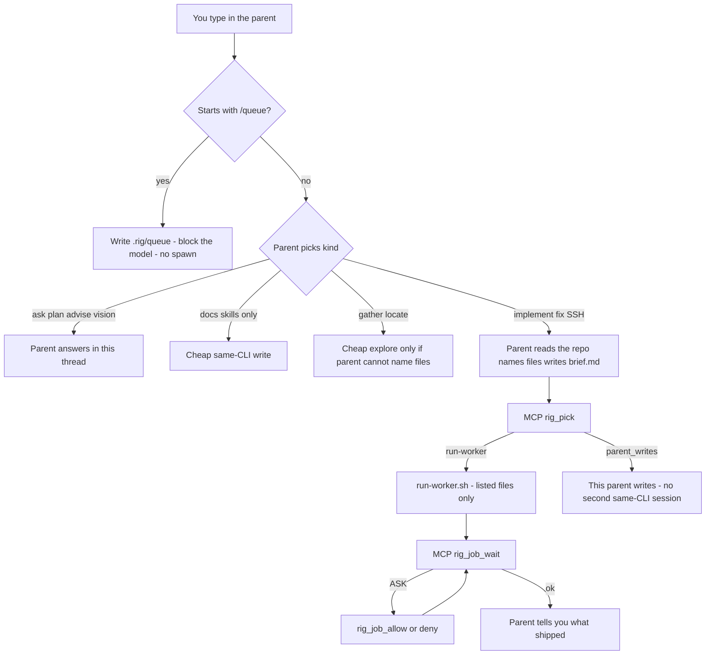
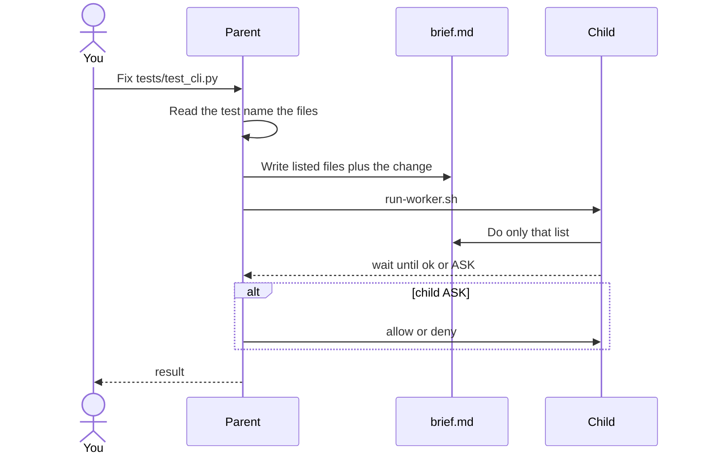
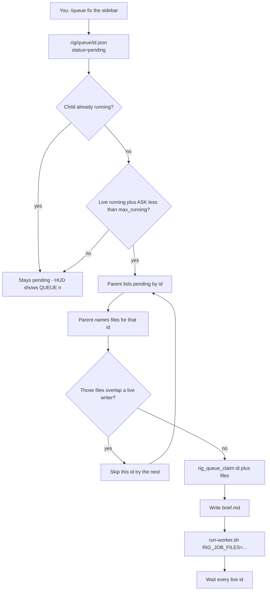

# Rig usage

Landing page: [README](../README.md) (prompt diagram, queue diagram, what setup installs).

In this file: [how your prompt is handled](#how-your-prompt-is-handled) · [why the queue](#why-the-queue-exists) · [queue](#how-the-queue-works) · [scenarios](#scenarios) · [install](#install) · [daily use](#daily-use) · [watch](#watch-jobs-memory) · [troubleshooting](#troubleshooting).

## What Rig is

The point is to stop you being the tired reviewer of one agent. You talk to a **parent** (intended: Codex on Astra). The parent assigns work to a **child**, then checks and sends feedback — allow/deny, another prompt — the loop you used to do yourself.

You stay in **one parent**: Codex, Grok, OpenCode, OMP, Pi, or agy. You talk to that parent. The parent picks **kind**. `rig pick` maps that kind to worker, model, and effort. Never spawn Astra, Sol, or Fable as a child.

- **Parent** (you open this): Codex, Grok, OpenCode, OMP, Pi, or agy. It plans, checks, talks to you, does vision / computer-use / chrome-profile, and watches jobs. It does **not** sit on write/review/SSH when a worker is effective.
- **Workers** (the parent may spawn these): Grok, Claude Code, Cursor CLI, OpenCode, OMP, Pi, agy, Codex. They write code, fix bugs, review, SSH/debug, and gather facts.
- **Never the parent:** Claude Code and Cursor. Opening those CLIs does not make them the Rig parent. The Antigravity IDE/GUI is not a parent or worker; the CLI is `agy`.
- **Live parent** is whichever Codex, Grok, OpenCode, OMP, Pi, or agy you actually opened (`rig status`). The `parent =` key in `.rig/harness.toml` is only the preferred default (`rig use grok|codex|opencode|omp|pi|agy`). Opening the CLI is what makes it live.
- **Missing binary is not a failure.** That worker is off. The parent uses a cheaper same-CLI worker. That is success.

**You need** one parent CLI: Codex, Grok, OpenCode, OMP, Pi, or agy. Optional worker binaries: `grok`, `claude`, `cursor-agent`, `codex`, `opencode`, `omp`, `pi`, `agy`.

Grok Bot.app and Cursor.app are GUIs, **not** spawnable workers. `rig doctor` may list them under **Apps (not spawnable)** as a hint. The Cursor worker binary is `cursor-agent`, not the GUI.

Codex CLI and Grok CLI are installed from those products (this guide does not pin their installer URLs). Optional worker CLIs:

```bash
curl https://cursor.com/install -fsS | bash
curl -fsSL https://opencode.ai/install | bash
curl -fsSL https://omp.sh/install | sh
npm install -g @earendil-works/pi-coding-agent
curl -fsSL https://antigravity.google/cli/install.sh | bash
```

## Install

```bash
curl -fsSL https://raw.githubusercontent.com/Brasth/Rig/main/install.sh | bash
```

That one line is the install. `| bash` is required. No GitHub login.

What that does:

- No GitHub login. `curl` pipes `install.sh` into bash.
- `install.sh` clones `https://github.com/Brasth/Rig.git` over HTTPS into a **temp** dir (needs `git`; if HTTPS clone fails and `gh` is logged in, it tries `gh repo clone`).
- Copies bin, scripts, skills, adapters, and templates into `~/.rig`.
- Symlinks `~/.local/bin/rig` → `~/.rig/bin/rig`.
- Runs `rig setup`.
- Deletes the temp clone. There is **no local clone to keep**.

From a checkout you already have: `./install.sh` (same copy + `rig setup`, no clone). That is the **dev** path; it copies the local tree, not GitHub `main`.

Update an existing machine: `rig update`. That fetches GitHub `main` through the same `install.sh` (not your checkout). The same `curl | bash` still works (idempotent). An older `rig` without `update` still needs the curl once. It updates the skill and scripts. It does **not** overwrite project `.rig/harness.toml` or `.rig/MEMORY.md`. It already runs `rig setup`.

**`rig setup` writes:**

- `~/.rig` (bin, scripts, skills, adapters, templates)
- Skill links in `~/.agents/skills`, `~/.grok/skills`, `~/.codex/skills`, `~/.config/opencode/skill`, `~/.omp/agent/skills`, `~/.pi/agent/skills`, `~/.gemini/antigravity-cli/skills` (`delegate-harness`, `rig-jobs`, and `rig-queue`)
- Codex `~/.codex/hooks.json` UserPromptSubmit (parks `/queue` / `$queue` and **blocks** the model; trust once with `/hooks`) plus leftover `~/.codex/prompts/queue.md` (not a 0.154 slash). After `/plugins` install **Rig Queue**, setup drops the duplicate hooks.json entry. OpenCode park plugin `~/.config/opencode/plugins/rig-queue.js` and TUI HUD `tui.json` → `tui-plugins/rig-hud.tsx` (file path, not npm). OMP/Pi extensions `~/.<omp|pi>/agent/extensions/rig-queue.js` (`/queue` even while streaming; HUD under the editor).
- Codex agent files under `~/.codex/agents` when they are Rig agents
- Grok bottom status line (`[ui.status_line]` → `rig-statusline` with QUEUE; restart Grok once). agy `statusLine.command` in `~/.gemini/antigravity-cli/settings.json` (skip if you already have a custom line; `/statusline` if the row is hidden).
- `[mcp_servers.rig]` in `~/.grok/config.toml` and `~/.codex/config.toml` **even if those files did not exist**
- `mcp.rig` in `~/.config/opencode/opencode.json` (or `mcp.servers.rig` if that map already exists)
- `mcpServers.rig` in `~/.omp/mcp.json`, `~/.pi/agent/mcp.json`, and `~/.gemini/config/mcp_config.json`
- Codex sandbox writable roots so Grok/Claude/Cursor/OpenCode/OMP/Pi/agy children can write sessions (`[sandbox_workspace_write]`)

Setup does **not** write project `mcp.json` / `opencode.json`. Setup does **not** add `pi-mcp-adapter` to Pi `settings.json`.

Success print:

```text
install ok  rig -> $HOME/.local/bin/rig
next: cd your-repo && rig init && rig doctor
```

If PATH is missing `~/.local/bin`, the installer also prints:

```text
add to PATH: export PATH="$HOME/.local/bin:$PATH"
```

Then persist it for zsh:

```bash
export PATH="$HOME/.local/bin:$PATH"
echo 'export PATH="$HOME/.local/bin:$PATH"' >> ~/.zshrc
source ~/.zshrc
```

Confirm the binary:

```bash
which rig
```

That must print `$HOME/.local/bin/rig` (for example `/Users/you/.local/bin/rig`). If it is empty, PATH is still wrong.

## First-time machine

Install already ran `rig setup`. Re-run `rig setup` after you update Rig (`rig update` or the curl install does this for you).

1. Fully quit Grok, Codex, OpenCode, OMP, Pi, and/or agy **once** so MCP tools, `/queue` adapters, and HUDs load (quit the apps, then reopen).
2. Run `rig doctor`. MCP lines should show `[mcp_servers.rig]` for grok and/or codex, plus OpenCode/OMP/Pi/agy JSON MCP when those files exist.
3. After setup, Grok gets a **bottom status line** with QUEUE. Restart Grok once if you do not see it. agy: `/statusline` if the row is hidden. OMP/Pi: widget under the editor. OpenCode: sidebar/footer from `tui.json` (file-path plugin). Codex: no panel — `/plugins` install **Rig Queue**, then `/hooks` trust.
4. Pi `/rig` also needs `pi install npm:pi-mcp-adapter` (setup writes `mcp.json` but does not install the package).

### What `rig doctor` should look like

`rig doctor` is the health check. Walk it top to bottom. “Good” looks like this (paths will be yours):

```text
Rig doctor
  RIG_HOME: /Users/you/.rig
  repo:     /Users/you/your-repo
  harness:  /Users/you/your-repo/.rig/harness.toml
  version:  v1 abc1234
  update:   current

Parent
  live:      grok
  preferred: codex

Workers
  grok    flag=true  bin=/usr/local/bin/grok          effective=off (is live parent)
  claude  flag=true  bin=/usr/local/bin/claude        effective=on
  codex   flag=false bin=/usr/local/bin/codex         effective=off (flag)
  cursor  flag=false bin=(missing)                    effective=off (flag)

Apps (not spawnable)
  grok-bot /Applications/Grok Bot.app
  cursor   /Applications/Cursor.app

Skill
  project: /Users/you/your-repo/.agents/skills/delegate-harness/SKILL.md
  ~/.agents/skills/delegate-harness -> /Users/you/.rig/skills/delegate-harness
  ...

Scripts
  run-worker: /Users/you/.rig/scripts/run-worker.sh (ok)

MCP
  grok:     /Users/you/.grok/config.toml [mcp_servers.rig]  (fully quit grok once to load tools)
  codex:    /Users/you/.codex/config.toml [mcp_servers.rig]  (fully quit codex once to load tools)
  opencode: /Users/you/.config/opencode/opencode.json mcp.rig  (fully quit opencode once to load tools)
  omp:      /Users/you/.omp/mcp.json mcpServers.rig  (fully quit omp once to load tools)
  pi:       /Users/you/.pi/agent/mcp.json mcpServers.rig  (fully quit pi once to load tools)
  agy:      /Users/you/.gemini/config/mcp_config.json mcpServers.rig  (fully quit agy once to load tools)
```

How to read each section:

| Section | Good | Bad |
| --- | --- | --- |
| **RIG_HOME** | `$HOME/.rig` | empty / missing — `rig update` or re-run the curl install or `rig setup` |
| **repo** | the git repo you `cd`’d into | wrong directory |
| **harness** | `.rig/harness.toml` exists | `(missing — run: rig init)` |
| **version** | `v1 <sha>` from `~/.rig/VERSION` | `(unknown — run: rig update)` |
| **update** | `current` | `behind main — run: rig update` (omitted if offline or `RIG_SKIP_UPDATE_CHECK`) |
| **Parent live** | `codex`, `grok`, `opencode`, `omp`, `pi`, or `agy` when you are inside that CLI; `(none)` in a plain terminal is normal | you expected a parent but opened Claude/Cursor |
| **Parent preferred** | `codex`, `grok`, `opencode`, `omp`, `pi`, or `agy` from `rig use` | — |
| **Workers** | the ones you want show `effective=on` | see reasons below |
| **Apps** | GUIs listed or `(missing)` | do **not** treat these as workers |
| **Skill** | project `SKILL.md` plus symlinks under `~/.agents`, `~/.grok`, `~/.codex`, `~/.config/opencode/skill`, `~/.omp/agent/skills`, `~/.pi/agent/skills`, `~/.gemini/antigravity-cli/skills` | `(missing — run: rig init)` or `(missing — run: rig setup)` |
| **Scripts** | `run-worker: … (ok)` | missing — `rig setup` again; Rig itself is broken |
| **Model catalogs** | `opencode: N models` on a fresh cache hit (`~/.rig/cache/model-catalogs.json`) | omitted when cache is missing or stale — doctor does not wait on the four CLIs |
| **MCP** | `[mcp_servers.rig]` on grok/codex plus JSON MCP on OpenCode/OMP/Pi/agy | `missing — run: rig setup`, then fully quit the app; Pi also needs `pi-mcp-adapter` |
| **Watch** | reminder of `rig tui` / `rig jobs` / `/rig` / `/queue` in Grok, Codex, OpenCode, OMP, Pi, or agy | — |

**`effective=off` reasons** (printed in parentheses):

- `flag` — `[workers].<name>` is `false`. Turn on with `rig workers <name>=on`.
- `no binary` — flag is true but the CLI is not on PATH (`grok`, `claude`, `codex`, `cursor-agent`, `agy`).
- `is live parent` — you opened that CLI as the parent, so it cannot also be a child this session (typical: Grok parent → Grok child off; OpenCode parent → OpenCode child off).

A worker is **effective** only when: flag true **and** binary on PATH **and** not the live parent.

## Per-project setup

```bash
cd your-repo
rig init
rig doctor
```

`rig init` is per repo. Do this in every project you want Rig to manage.

**Files:**

| Path | What happens |
| --- | --- |
| `.rig/harness.toml` | Agent config. **Kept** if it already exists. |
| `.rig/MEMORY.md` | Durable standing facts. **Kept** if it exists. |
| `.rig/STATE.md` | Last job snapshot (overwritten each run). **Kept** if it exists on first write; later runs overwrite contents. |
| `.agents/skills/delegate-harness/SKILL.md` | **Refreshed every init.** |
| `.agents/skills/rig-jobs/SKILL.md` | **Refreshed every init.** |
| `.agents/skills/rig-queue/SKILL.md` | **Refreshed every init.** `/queue` parks work; does not spawn. |
| `AGENTS.md` | Inserts a **MUST use Rig** block at the **top** (markers `<!-- rig:start -->` / `<!-- rig:end -->`). Never replaces the rest of the file. `--no-patch-agents` skips. |
| `CLAUDE.md` | Only with `--patch-claude`, and only if the file is **missing**. |
| `.gitignore` | If the file exists, appends `.rig/jobs/`, `.rig/thread`, and `.rig/queue/` when those lines are not already there. |

**New harness only:** Grok / Claude / Cursor / OpenCode / OMP / Pi / agy are turned **on** if that CLI is on PATH. Codex stays **off** (preferred parent). **Existing harness flags are never flipped.** Missing worker keys are appended as `false` → enable later with `rig workers <name>=on`. Missing `[queue] max_running` is appended as `3`; an existing value is kept.

Open a **new** parent thread after init. An old Grok/Codex/OpenCode/OMP/Pi/agy session will not pick up `AGENTS.md` or skills.

Do **not** use `rig run` for normal work. Just prompt in the parent CLI.

## Configure agents

Edit `.rig/harness.toml` or use the `rig` commands below. Real template shape:

```toml
parent = "codex"
# parent = "grok"
# parent = "opencode"
# parent = "omp"
# parent = "pi"
# parent = "agy"

[workers]
codex = false
grok = true
claude = true
cursor = false
opencode = false
omp = false
pi = false
agy = false

[queue]
max_running = 3
```

**Each key:**

- **`parent`** — preferred default only (`"codex"`, `"grok"`, `"opencode"`, `"omp"`, `"pi"`, or `"agy"`). Live parent is whichever CLI you opened (`rig status`). `rig use grok` / `codex` / `opencode` / `omp` / `pi` / `agy` writes this key; you still have to **open** that CLI. Switching the key does not move an already-open session. Claude and Cursor are never `rig use` targets. Parent **model** is the CLI’s model; worker models come from `rig pick`. Never spawn Sol, Astra, or Fable as a child.
- **`[workers].*`** — allow-list, not “install for me”. `true` means “this CLI may be spawned **if** its binary is on PATH and it is not the live parent”. Commands:

  ```bash
  rig workers grok=on|off claude=on|off codex=on|off cursor=on|off opencode=on|off omp=on|off pi=on|off agy=on|off
  ```

Effective worker = flag `true` **and** binary on PATH **and** not live parent. Check with `rig doctor` / `rig status`. `grok = false` turns off grok as a child. Open Grok and you still get native Grok. Open Pi with grok off and pick must stay Pi.

- **`[queue].max_running`** — max live jobs (`running` + `ask`) per repo (default 3). Slot cap, not “run the next 3.” Parent claims a disjoint subset **by id** (required when more than one pending). `job start` / `run-worker.sh` refuse a new job at cap or when listed files overlap a live writer. `rig queue list` shows occupied files. Set to `1` to restore one-child. Existing values are never flipped on init.
- **`[queue].max_per_worker`** — extra cap per worker name (default `0` = off). `[queue.workers].grok = 2` overrides for that worker. Fair drain is highest `priority` (0–9) then oldest pending.

**Binaries:**

| Worker | Binary | Not a worker |
| --- | --- | --- |
| Grok | `grok` | Grok Bot.app |
| Claude Code | `claude` | — |
| Codex | `codex` | — |
| Cursor | `cursor-agent` | Cursor.app GUI |
| OpenCode | `opencode` | — |
| OMP | `omp` | — |
| Pi | `pi` | another unrelated `pi` on PATH |
| Antigravity | `agy` | Antigravity IDE/GUI |

### Examples

**Enable Cursor as a worker**

1. Install the Cursor CLI (GUI is not enough):

   ```bash
   curl https://cursor.com/install -fsS | bash
   ```

2. Allow it in this repo:

   ```bash
   rig workers cursor=on
   ```

3. `rig doctor` until `cursor` shows `effective=on`. Cursor is never the parent, so "is live parent" will not apply to it.

**Enable Claude as a worker**

1. Install the `claude` binary (no URL here — use Anthropic’s CLI install).
2. `rig workers claude=on`
3. `rig doctor` until `claude` is `effective=on` (unless you opened Claude as… you cannot; Claude is never the parent).

**Enable OpenCode, OMP, Pi, or agy as a worker**

Existing project flags stay off until you turn them on:

```bash
rig workers opencode=on
# or: rig workers omp=on
# or: rig workers pi=on
# or: rig workers agy=on
rig doctor
```

If both OMP and Pi are on as workers of a *different* parent, pick uses **OMP** (same family; OMP is the Pi fork). They can be the parent when you open that CLI (`rig use omp` / `rig use pi` / `rig use agy`, then open it). OpenCode `--auto` is required for headless spawn (no TTY). OMP uses `--approval-mode write`, not `--auto-approve`. agy uses print-mode JSON with `--mode accept-edits`; it does **not** use `--dangerously-skip-permissions`.

Do **not** enable Claude on every project. You choose. Existing project flags stay until you run `rig workers`.

**Prefer Grok as parent**

```bash
rig use grok
```

Then **open Grok** in the repo. Grok-as-parent means the Grok **child** is off for that session (`effective=off (is live parent)`). Implement work then goes to Claude if effective, else cheap same-CLI Grok.

**Prefer OpenCode, OMP, Pi, or agy as parent**

```bash
rig use opencode
# or: rig use omp
# or: rig use pi
# or: rig use agy
```

Then **open that CLI** in the repo. That CLI is off as a child. Implement: Grok child if effective, else Claude, else cheap same-CLI with that CLI's pins. Fully quit once after setup so MCP `/rig` loads. Pi also needs `pi install npm:pi-mcp-adapter`. When live parent is agy, do not use nested agy `/agent` dispatch for coding; use `rig pick`.

**Prefer Codex as parent**

```bash
rig use codex
```

Then open Codex. Parent model is the CLI’s model. Worker models come from `rig pick`. Never spawn Sol, Astra, or Fable as a child.

## How your prompt is handled

You type in the **parent** CLI. That text is **not** forwarded as the child’s prompt. The parent classifies it, and only implement-like work is rewritten as `.rig/jobs/<id>/brief.md` (files to change, what to change, what not to change). The child sees that brief.





| Kind of prompt | Stays on parent? | Child? | Your chat reused as child prompt? |
| --- | --- | --- | --- |
| Question, plan, advise, “how does X work” | Yes | No | — |
| Vision, Figma, computer-use, chrome-profile | Yes | No | — |
| Docs/skills-only | Cheap same-CLI may edit docs | Mini, not implement | No — brief if it writes |
| Implement / fix / SSH | Parent **checks first** | Yes, unless `parent_writes` | **No** — `brief.md` |
| `/queue …` | Park only | Not from the hook | No |

The parent does **not** ask you which model. `rig pick` maps kind → worker, model, effort.

## Why the queue exists

Every parent CLI is one user message → one turn. While a child runs (often several minutes) and `rig_job_wait` blocks, that session does not run another command. You still think of more work. Sending it as a normal prompt would interrupt wait/ASK (illegal) or get lost until the child finishes. The queue lets you **park** those extras now; on a free turn the parent checks the lot, writes briefs, and spawns — so independent work finishes instead of sitting idle behind one job.

Two locks force that design:

1. **Parent chat turn.** One prompt at a time. Interrupting wait/ASK is illegal. Mid-wait you still park only: `/queue`, TUI `e`, or `rig queue add` in another pane — never a spawn from the hook/HUD/`e`.
2. **One-child policy.** Until implement is ok, one writer on those files. Without a queue drain, that also serialized *independent* work. Drain allows up to **3** live children when listed files are **disjoint**. Same-file items stay serialized.

| | Without queue | With queue |
| --- | --- | --- |
| Extra ideas while a child runs | Wait until the child is done, or interrupt wait/ASK | Park now (`/queue` / TUI `e` / `rig queue add`) |
| Independent follow-ups | One live writer until that job ends | Free-turn drain: up to 3 live jobs if files do not overlap |
| Who starts the child | — | Parent still names files and writes `brief.md` |

What the queue is **not**: a dispatcher (park ≠ spawn), a daemon that auto-spawns with no parent brief, ASK / child inbox, or a forward of the parent chat as the child prompt.

Cap 3 (`[queue].max_running`) is so independent work can overlap without a swarm. Set to `1` to restore strict one-child.

## How the queue works

Park ≠ spawn. `/queue`, TUI `e`, `rig queue add`, and the Grok/Codex/OpenCode/OMP/Pi adapters only write `.rig/queue/`. The HUD (`jobs.py hud`) is read-only. Drain happens on a **free** parent turn, after the parent names files and writes a brief.



Rules that surprise people:

- **Id is required** when more than one item is pending. Claiming without an id stamps files onto the wrong row.
- **Skip overlap, do not abort.** Item B can still run if its files are free.
- **ASK counts as live.** A Claude child waiting on allow fills a slot.
- **`parent_writes` occupies this turn.** Do not drain more writers while this parent is writing.
- **Stay/advise never become children** even if they were parked by mistake — the parent answers or leaves them pending.

Cap: `[queue].max_running` (default 3). Optional `[queue].max_per_worker` (default 0 = off).

## Scenarios

### 1. One implement prompt, parent is free

You: `tests/test_cli.py is failing — fix it.`

1. Parent reads the test, names `tests/test_cli.py` and the production file it covers.
2. Writes `brief.md` with those files and the failing assertion.
3. `rig pick` implement → usually a Grok child (or Claude if Grok is the live parent).
4. You watch `/rig` or the HUD (`QUEUE 0 · live 1/3`).
5. Parent waits. When the child is ok, it tells you what changed.

You did not pick a model. You did not run `rig run`.

### 2. You ask a question

You: `Why does pick skip Grok when I am in Grok?`

Stay. Parent answers (live parent cannot spawn itself). No `brief.md`. No child.

### 3. A child is already running; you think of more work

This is the reason the queue exists: the child may run five minutes, and you remember two more unrelated fixes. You cannot send them as normal prompts without interrupting wait/ASK. Park both; they start when free / cap / disjoint allow.

Child is implementing pagination. You type:

`/queue after that, fix the empty-state copy on the jobs list`

and later (still mid-wait):

`/queue also fix the sidebar badge count`

Grok/Codex: the submit hook **blocks** that line from becoming a new Astra/Grok turn and writes `.rig/queue/`. OpenCode: `/queue` parks then throws so `prompt()` does not run (1.17.5+ may flash `__RIG_QUEUE_HANDLED__` — that is the skip). OMP/Pi: `/queue` runs even while streaming.

The running child is not killed. HUD shows `QUEUE 2`. When the parent is free, it claims each **id** whose files are free (skip overlap), names files, briefs, spawns — up to the live cap.

Same park without a slash: `rig tui` key `e`, or another pane `rig queue add "…"`.

### 4. Two queued items, overlapping files

Pending:

- `abc` — `src/jobs.py`
- `def` — `src/queue.py`

A writer is already live on `src/jobs.py`. Drain: skip `abc`, claim `def` if those files are free. `abc` stays pending. List shows occupied files.

### 5. Claude child needs permission (ASK)

`rig jobs` / HUD shows `ASK`. Parent (not you clicking in the child TUI) answers MCP `rig_job_allow` or `rig_job_deny`. Human TUI: `y` / `n`.

Do **not** kill that job. Do **not** spawn Grok “instead”. The same Claude continues after allow. The work timeout pauses during ASK.

### 6. You are in Grok as parent

Grok child is `effective=off (is live parent)`. `Fix the tests` still runs: Claude if effective, else this Grok writes (`parent_writes`). No second Grok session.

### 7. Codex parent, you type `/queue` while Astra is streaming

After `rig setup`, `/plugins` **Rig Queue**, `/hooks` trust, fully quit once: `/queue fix sidebar` parks and **does not** start an Astra implement turn. 0.154 has no `/prompts:queue` autocomplete. Companion `rig tui` if you want a board. Codex has no in-TUI HUD panel.

### 8. Docs-only

You: `Update README to mention the HUD.`

Mini. Parent (or cheap same-CLI) edits `README.md` / `docs/usage.md`. Not an implement child unless the change is mixed with code.

### 9. Review after a successful implement

Implement is `ok`. Parent **may** start one read-only review (different vendor) and one seed/bulk whose files are **disjoint**. One wait on both ids. Until implement is ok: one writer on those files.

### 10. Park on agy

agy 1.2.0 has no `UserPromptSubmit`. `/queue` on a free turn can still park via the skill. Mid-wait: `rig tui` `e` or `rig queue add`. Statusline still shows QUEUE after setup (`/statusline` if hidden).

## Daily use

Numbered path for a human:

1. `cd` to the repo. Confirm `which rig` and that `.rig/harness.toml` exists (`rig init` if not).
2. Open **Codex, Grok, OpenCode, OMP, Pi, or agy** in that repo. After init or setup, use a **new** thread.
3. In a new thread, the parent’s first call is MCP `rig_session` (memory + jobs + status + pick). Humans can still run `rig tui` / `rig jobs` in a terminal.
4. Type a normal prompt. Do not pick a model. Do not run `rig run`. Walk-throughs: [scenarios](#scenarios).

   Examples:

   - `Implement pagination on the jobs list.` → implement (brief + child)
   - `tests/test_cli.py is failing — fix it.` → implement
   - `Why is Grok off as a child while I am in Grok?` → stay
   - `Review the diff I just staged.` → review
   - `SSH to the box and collect the app logs from the last deploy.` → implement/SSH
   - `/queue after this, fix the empty-state copy` → park, no spawn

5. Ask / plan / advise stay with the parent. Docs/skills-only uses MCP `rig_pick` `role` mini. The parent checks first for implement: reads the code, names the files and the update, writes that in the brief, then MCP `rig_pick` `role` implement and spawns if needed. Spawn explore/mini for codebase gather only if the parent cannot name the files after a short check. If the implement brief already lists files, do not also spawn explore. It does **not** ask you which model. Child does not assume scope and does not hunt extra updates. `--case` is the task text (fallback English if the parent omitted kind). Pick does not ship device skill names.
6. Watch the child: another terminal `rig tui` or `rig jobs`, or type `/rig` in Grok, Codex, OpenCode, OMP, Pi, or agy. Grok/agy statusline and OMP/Pi/OpenCode HUDs show QUEUE + live jobs after setup (restart / fully quit once). Codex has no custom panel — `/plugins` Rig Queue + hook toast, or companion `rig tui`.
7. `rig jobs` is a table. Columns: **STATUS AGENT ROLE JOB TASK**. Example:

   ```text
   STATUS    AGENT    ROLE       JOB                              TASK
   running   grok     worker     20260909T032405Z-82424          Implement pagination
             model  grok-4.6   reasoning high
             log    rig job log 20260909T032405Z-82424 -f
   ```

8. If a Claude child is `ask`: the **parent** answers MCP `rig_job_allow` or `rig_job_deny` (human TUI `y` / `n`). Never kill that job. Never spawn another worker because Claude asked. The same child continues after you allow. After implement+verify ok, seed (disjoint listed files) may already be running next to a read-only review — MCP `rig_job_wait` `ids`; do not replace either. Spawn never started: one MCP `rig_pick` `exclude` (last-resort opencode, omp, pi, agy, codex). Do not auto-spawn Cursor.
9. Jobs and MEMORY are **this repo**, not the chat. A new thread still sees `.rig/jobs`. Running children keep going.

**Parent keeps:** ask / plan / advise, check (name files and the update), vision, Figma, computer-use, chrome-profile, talk to you. Native implement/hard (`parent_writes`): this parent writes + MCP `rig_job_record`.

**Workers:** write the listed change when pick is `run-worker`, not hunt on a fix. Follow skill file paths in the brief. Review, SSH/debug. Codebase gather only if the parent cannot name the files.

Figma / computer-use / chrome-profile stay with the parent. If this CLI has no Figma MCP, ask for a screenshot. Do not spawn a clicker.

### Routing

| Case | Who |
| --- | --- |
| Ask / plan / advise / vision / computer-use / chrome-profile / Figma | parent (MCP `rig_pick` stay). Do not spawn a clicker |
| Docs/skills-only | cheap same-CLI (MCP `rig_pick` mini) |
| Locate / trace / codebase gather | cheap same-CLI explore/mini only if the parent cannot name the files after a short check |
| Implement / SSH / fix | Grok child if Grok is **effective**; if Grok/OpenCode/OMP/Pi/agy is the live parent (or Grok off) → Claude Code if effective, else native `parent_writes` (this parent writes; no second same-CLI session). Last-resort children: opencode, omp, pi, agy, codex, then cursor. Do not auto-spawn Cursor on fallback |
| Review | different vendor than the writer. No other vendor → do not self-review |
| After implement+verify ok | MAY start read-only review **and** seed/bulk with **disjoint listed files** in parallel. One wait on both ids |
| Independent queued items | Up to `[queue].max_running` (default 3 live `running`+`ask`) if listed files are disjoint. Parent **selects a subset by id** (skip overlap, try next; omit id only if one pending). List shows occupied files. Until **that write** is ok: one child on those files. Never a second writer on the same files. Never explore/fix/QA teammates on the same write. `/queue` parks only; drain is the parent on a free turn |
| No extra CLIs | cheap same-CLI. Record it. That is success |

Pin **full** model IDs (aliases drift). Codex / Grok / Claude / Cursor stay static pins. OpenCode / OMP / Pi / agy pins are **preferences**: `rig pick` and `run-worker.sh` list models from that CLI and pick one that exists. Catalog cache: `~/.rig/cache/model-catalogs.json` (TTL ~1 hour). `RIG_REFRESH_MODELS=1` refreshes. `RIG_SKIP_MODEL_CATALOG=1` keeps the static pin. Never Sol / Astra / Fable, even if the catalog lists them.

- Claude: `claude-haiku-4-5-20251001` cheap, `claude-sonnet-5` implement, `claude-opus-5` hard/review
- Cursor: `composer-2.5-fast` cheap, `composer-2.5` implement, `cursor-grok-4.6-high` hard, `claude-opus-5-thinking-high` review
- Grok: implement `grok-4.6` high; explore `grok-4.5`
- Codex: cheap `gpt-5.6-luna` low; explore `gpt-5.3-codex-mini`. Hard Codex work can use `gpt-5.6-terra` medium
- OpenCode: cheap `openai/gpt-5.4-mini` `--variant minimal`; implement `openai/gpt-5.6-luna` `--variant high`; hard/review `openai/gpt-5.6-terra` `--variant max`
- OMP / Pi: cheap `grok-4.5` `--thinking low`; implement/hard `grok-4.6` `--thinking high`; review `claude-opus-5` `--thinking high`
- agy: cheap `gemini-3.8-flash-low` `--effort low`; implement `gemini-3.8-flash-high` `--effort high`; hard/review `gemini-3.1-pro-high` `--effort high`

Never Fable / Sol / Astra as a child. Opus is allowed.

## Watch, jobs, memory

A Grok child is **headless**. Codex will not show its TUI. While it runs, both you and the parent can see **which agent, which task, status, and the log**.

Parent agent: MCP. First call: `rig_session`. Instant: `rig_jobs`, `rig_job_show`, `rig_job_log`, `rig_job_allow`, `rig_job_deny`, `rig_job_message`, `rig_memory`, `rig_memory_add`, `rig_pick`, `rig_status`, `rig_job_start`, `rig_job_finish`, `rig_job_record`, `rig_queue_add`, `rig_queue_list`, `rig_queue_cancel`, `rig_queue_claim`. Launching a child is still bash `run-worker.sh`; there is no spawn-from-MCP tool. Wait is one blocking `rig_job_wait` with **no timeout**. After implement+verify ok, pass `ids` to wait review+seed together. If the parent host supports MCP progress, `rig_job_wait` may stream the child `doing` line. If a parent host **kills** the MCP tool, fall back to **one** bash `rig job wait <id>` with **no** `--timeout`. Do not poll 30s.

Human terminal (not the parent agent):

```bash
rig tui                 # jobs board (agent / task / status / live log)
rig jobs                # same data as a table
rig jobs --json
rig jobs --thread
rig tui                 # e = enqueue one line
```

Bash fallback if MCP is missing:

```bash
rig job wait <id>
rig job wait <id1> <id2>
rig job show
rig job log <id> -f
rig queue add "text"
rig queue list
rig queue cancel <id>
```

`--timeout SECS` is an optional cap, not the default. Omit timeout to block. `0` snapshots once. Exit 124 only if still running when a cap hits.

In Grok, Codex, OpenCode, OMP, Pi, or agy type `/rig` or `/queue`. `/queue` parks a line in `.rig/queue/` and does **not** spawn.

| Parent | In-composer park | HUD | Mid-wait |
| --- | --- | --- | --- |
| Grok | `/queue fix pagination` (submit hook blocks the model) | bottom status line includes QUEUE + live/ASK (restart Grok once) | same hook |
| Codex | `/queue …` or `$queue park …` after `rig setup` + **`/hooks` trust** + fully quit once. Prefer `/plugins` **Rig Queue** (same hook). No `/prompts:queue` slash in 0.154. No custom TUI panel. | hook `systemMessage` on park; companion `rig tui` | same hook, or `!rig queue add "…"` |
| OpenCode | `/queue …` via plugin. On 1.17 the plugin **throws** after park so `prompt()` does not run (the only skip). 1.17.5+ may flash a TUI error `__RIG_QUEUE_HANDLED__`; that is the skip, not a failed park. `$queue park …` rewrites the user text (model may still answer). Fully quit once after setup. | `tui.json` file-path plugin `rig-hud.tsx` (sidebar/footer). If the slot does not paint, use `rig tui`. | same park plugin if composer still accepts input; else `rig tui` `e` |
| OMP / Pi | `/queue …` extension command (`~/.omp/agent/extensions/rig-queue.js`, `~/.pi/agent/extensions/rig-queue.js`). Runs even while streaming. Fully quit once. | widget under the editor + footer status | same `/queue` |
| agy | skill / `/queue` on a free turn (no UserPromptSubmit) | `statusLine.command` → same `jobs.py hud` (`/statusline` if hidden) | `rig tui` `e` or `rig queue add` |

Grok hook: `~/.grok/hooks/rig-queue-submit.json`. Codex: `/plugins` Rig Queue **or** `~/.codex/hooks.json` (not both) + `[features] hooks = true`. Bare `/queue` (list) is not blocked. `rig tui` key `e` always parks. HUD refresh is read-only and never spawns. `rig setup` probes the `agy` binary for `UserPromptSubmit` and only then writes `~/.gemini/config/hooks.json`. agy 1.2.0 has PreInvocation, not UserPromptSubmit — skip (use `rig tui` `e`).

MCP tools load after `rig setup` + fully quit the parent CLI once. Parent agents use MCP. Launch is still bash `run-worker.sh`. Wait is MCP `rig_job_wait` with no timeout (`ids` for a review+seed panel); one bash `rig job wait` only if the host drops the tool.

Open the Grok child TUI yourself: `grok -r <session-id>` or `grok dashboard`. The job folder has `WATCH.md`.

Claude has no TTY as a child. When it needs permission, the job status becomes `ask` and MCP `rig_job_wait` returns ASK. The **parent agent** answers MCP `rig_job_allow` / `rig_job_deny`. Do not ignore it, kill the job, or spawn another worker. Human TUI: `y` / `n`. The child work timeout pauses while status is `ask` and restarts after allow.

Jobs are this repo, not this chat. A new parent thread still sees `.rig/jobs`. Running children keep going. First call in a new thread: MCP `rig_session`. Else MCP `rig_memory` then `rig_jobs` then `rig_status` then `rig_pick`. Bash fallback if MCP is missing: `rig session --case "..." --json`.

Memory is local only. Parent: MCP `rig_memory_add`. Do not edit the file. Human / fallback: `rig memory add "Codex sandbox must write ~/.grok"`.

- `.rig/MEMORY.md` — durable bullets, about 120 lines. No transcripts. `add` drops duplicates and caps the file.
- `.rig/STATE.md` — overwritten each run (last job / worker / status / summary).
- `.rig/jobs/` — gitignored. Each job records the parent `thread` when known. `rig prune` drops jobs older than 7 days and keeps the last 20. Successful jobs delete `stdout.log` after decoded activity is saved in `activity.json` (`rig job log` still works). If the log cannot be decoded, the raw log is kept. Fail/timeout logs stay for debug. Never read Cursor `state.vscdb` or other vendor sqlite to learn a Rig job — use `rig job log` / MCP.
- Child MCP: when `RIG_JOB_ID` is set, Rig MCP is job-scoped (`rig_job_doing`, `rig_job_note`, `rig_job_ask`, `rig_job_inbox`). It cannot pick, wait, spawn, queue, or allow. Do not run the `rig` CLI as a child. Parent MCP stays the orchestrator. MCP `rig_job_message` leaves one inbox note; the child pulls `rig_job_inbox` **once per turn** (empty is fine). Inbox is not ASK and does not wake wait. Cursor print-mode has no isolated `--mcp-config`; do not install Rig into `~/.cursor/mcp.json`.
- `.rig/queue/` — gitignored user work queue. MCP `rig_queue_add` / `/queue` parks text and does not spawn. On a free turn the parent claims a **disjoint subset by id** via `rig_queue_claim` (list shows occupied files; skip overlap and try the next id; omit id only if one pending), briefs, spawns, then MCP `rig_job_wait` on all live ids. Cap `[queue].max_running` (default 3). Mid-wait enqueue: MCP `rig_queue_add`.
- `.rig/thread` — gitignored (parent thread id).

## Troubleshooting

**`rig: command not found`**

`~/.local/bin` is not on PATH. In zsh:

```bash
export PATH="$HOME/.local/bin:$PATH"
echo 'export PATH="$HOME/.local/bin:$PATH"' >> ~/.zshrc
which rig
```

Re-run the install if `~/.local/bin/rig` itself is missing:

```bash
curl -fsSL https://raw.githubusercontent.com/Brasth/Rig/main/install.sh | bash
```

If `rig` is already on PATH: `rig update`.

**MCP missing in Grok, Codex, OpenCode, OMP, Pi, or agy** (`rig doctor` MCP lines do not show `[mcp_servers.rig]` / `mcp.rig` / `mcpServers.rig`, or `/rig` / tools are absent)

1. `rig setup`
2. Fully quit the parent **app**, then reopen
3. `rig doctor` — MCP lines should show the server
4. Pi only: `pi install npm:pi-mcp-adapter` if doctor prints that hint, then fully quit Pi again

**Worker `effective=off`**

Read the reason in `rig doctor`:

- `flag` → `rig workers <name>=on`
- `no binary` → install that CLI so `grok` / `claude` / `codex` / `cursor-agent` is on PATH
- `is live parent` → expected (that CLI cannot spawn itself). Use another worker or cheap same-CLI

**Claude child `timeout` right after you allow**

The work clock used to keep counting the minutes spent waiting for allow. It now pauses during `ask` and restarts after allow. Update Rig (`rig update`, or `./install.sh` from a checkout, or the same curl install) so `~/.rig/scripts/run-worker.sh` has that restart. Do not kill an asking job; allow/deny and wait.

**Parent not spawning / ignoring Rig**

Usually an **old thread**. Run `rig init`, then open a **new** parent thread in the repo. Confirm `AGENTS.md` has the `<!-- rig:start -->` block at the top and `.agents/skills/delegate-harness/SKILL.md` exists.

**Cursor not spawning**

Need the `cursor-agent` binary **and** `rig workers cursor=on`. Cursor.app GUI is not enough. `rig doctor` prints the CLI install if `cursor-agent` is missing:

```bash
curl https://cursor.com/install -fsS | bash
rig workers cursor=on
rig doctor
```

**Install failed to clone**

Need `git` (or a logged-in `gh`). The installer clones `https://github.com/Brasth/Rig.git`. Error looks like: `install: could not clone … (need git, or gh auth)`.

**Child fails with `FS_PERMISSION_DENIED` creating a session**

Codex sandbox must allow writing `$HOME/.grok` (and `$HOME/.claude` / `$HOME/.cursor` / `$HOME/.opencode` / `$HOME/.omp` / `$HOME/.pi` / `$HOME/.gemini` if used) plus outbound network. `rig setup` adds those writable roots. Re-run `rig setup`.

**`/queue` still starts a model turn (Codex)**

Need all of: `rig setup`, Codex `/plugins` install **Rig Queue** **or** a Rig `UserPromptSubmit` in `~/.codex/hooks.json` (not both after the plugin is enabled), `[features] hooks = true`, **`/hooks` trust**, fully quit Codex once. 0.154 has no `/prompts:queue` slash. Bare `/queue` (list) is not blocked on purpose. `codex_hooks` is deprecated — `rig setup` migrates it to `hooks`.

**`/queue` flashes `__RIG_QUEUE_HANDLED__` in OpenCode**

That is the 1.17 skip of `prompt()` after a successful park. Check `rig queue list`. Not a failed enqueue.

**HUD missing after setup**

Fully quit the parent app once. Grok: statusline command in `~/.grok/config.toml`. agy: `/statusline`. OpenCode: `tui.json` must list the **file path** to `rig-hud.tsx` (not an npm spec). Codex has no HUD panel — use `rig tui`.

**OpenCode / OMP / Pi / agy not spawning**

Need the binary **and** `rig workers opencode=on` (or `omp=on` / `pi=on` / `agy=on`). Existing harness flags stay off. `rig doctor` prints the install hint if the CLI is missing. As workers they are last resort: a Grok parent with no Claude still uses cheap same-CLI Grok, not OpenCode, just because `opencode` is on PATH. As parents, open that CLI (`rig use opencode|omp|pi|agy`).

## Parent agents

Parent agents: load `.agents/skills/delegate-harness/SKILL.md`. Live wrapper is `RIG_LIVE=1` + `run-worker.sh` in the background, then one blocking `rig job wait` (MCP `rig_job_wait` if present; no `--timeout`; `ids` for review+seed after implement ok). Default wrapper is dry-run. Claude `ask` → `rig job allow` / `rig job deny`. Never kill an asking job.

Cheap same-CLI spawns (Codex explorer/worker/bulk/reviewer, Grok explore, OpenCode/OMP/Pi/agy explore/worker/bulk) often do not use `run-worker.sh`. Record them so they still show under `.rig/jobs/`:

```bash
rig job record --worker codex --role explorer --status ok --summary "traced remaining gates"
```

A Claude Code child uses print-mode `stream-json` so the TUI can show tools while it runs. Print prompt is last argv. It does **not** use `--bare` (that drops OAuth) or `--dangerously-skip-permissions` (org policy can forbid bypass). Anthropic remote settings may print `Bash(eval $(wget*))` mismatched-parentheses warnings; those rules are skipped by Claude and hidden by `rig jobs` / `rig tui`. Haiku cheap jobs still record `low` on the board but do not pass `--effort` into Claude Code (Haiku print-mode hangs).

A Cursor child is `cursor-agent -p` with `stream-json`, `--force`, `--trust`, and `--workspace` set to the repo. It does **not** use `--worktree` (edits would leave the repo). `rig doctor` mentions Grok Bot.app and Cursor.app when they exist; those GUIs cannot be spawned.

An OpenCode child is `opencode run --format json --dir <repo> --auto`. An OMP child is `omp -p --mode json --approval-mode write`. A Pi child is `pi -p --mode json --approve`. An agy child is `agy -p` with `--output-format json --mode accept-edits --print-timeout <RIG_TIMEOUT>s --disable-slash-commands`. No `--dangerously-skip-permissions`. `run-worker.sh` fills `RIG_MODEL` / `RIG_EFFORT` from `rig pick` when unset (OpenCode `--variant`, OMP/Pi `--thinking`, agy `--effort`). OpenCode / OMP / Pi / agy models are resolved against that CLI’s live catalog (cached). If both OMP and Pi are effective, pick uses OMP. agy `denied_actions` in JSON is a fail even when the process exits 0.

The parent picks **kind**. Pick maps kind to worker, model, and effort. Do not ask the user. Pass the kind: `rig pick implement --case "<task>"` or `rig pick stay --case "<task>"`. `--case` is fallback English when the parent did not choose a kind. Pick does not ship device skill names. Plan/vision/computer-use/chrome-profile/Figma: `rig pick stay`. Native implement/hard: `parent_writes` — this parent writes. Dead spawn: one `rig pick --exclude`. First parent call: `rig session` / MCP `rig_session` when present.

## Commands

```text
usage: rig <command> [args]

  setup
  update
  init [--patch-agents|--no-patch-agents] [--patch-claude]
  doctor
  status
  use codex|grok|opencode|omp|pi|agy
  workers grok=on|off claude=on|off codex=on|off cursor=on|off opencode=on|off omp=on|off pi=on|off agy=on|off
  prune
  run "prompt"
  jobs [--json] [--thread [ID]]
  tui
  memory [show]
  memory add "standing fact"
  job start [--worker NAME] [--role ROLE] [id]
  job finish <id> [--status ok|fail] [--summary TEXT]
  job record [--worker NAME] [--role ROLE] [--status ok|fail] [--summary TEXT] [id]
  job show [id]
  job log [id] [-f] [-n N]
  job allow [id]
  job deny [id] [--reason TEXT]
  job wait [id] [--timeout SECS]
  job message <id> --text TEXT
  pick [explore|mini|bulk|implement|hard|review|stay] [--case TEXT] [--json]
```

Stay in Codex, Grok, OpenCode, OMP, Pi, or agy. They can invoke Claude, Cursor, OpenCode, OMP, Pi, agy, or each other.

Parent model is the CLI’s model. Worker models come from `rig pick`. Never spawn Sol, Astra, or Fable as a child.

`rig run "prompt"` exists but is **not** the daily path — type the prompt in the parent CLI instead.
